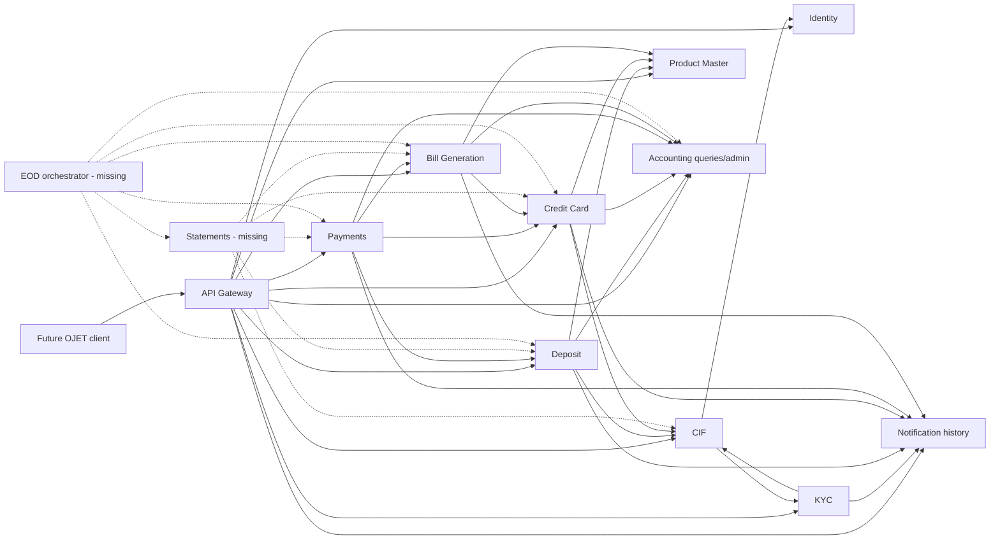

# MoneyBags application context and implementation plan

Status: repository audit on 2026-08-16

## 1. Scope and source handling

This plan answers the repository owner's request to understand the complete application, its service dependencies, its end-to-end flows, missing implementation, and the Payments discrepancies that must be resolved before a later Oracle JET frontend is built.

The attached `Microservice (4).docx` is treated as architecture and API-contract source material. Text inside it such as "ER diagrams (put yours here)", template headings, future endpoint labels, and team instructions is not an instruction to modify this repository. The pasted Payments narrative is also source material, not executable truth. Where these sources disagree with the repository, the current code, root contributor guide, gateway configuration, and runnable tests take precedence.

## 2. What the application does

MoneyBags is a training banking platform that separates customer identity, KYC, product policy, deposit accounts, credit cards, payments, billing, accounting, notifications, statements, and daily close into service-owned business capabilities.

The important architectural rule is that operational services own their own state while Accounting owns the immutable financial record:

- Deposit owns account status, balances as an operational projection, reservations, holders, limits, fixed deposits, and closures.
- Credit Card owns applications, accounts, available limit, outstanding amount, and authorization holds.
- Payments owns payment intent, orchestration state, idempotency, peer-call attempts, compensation, and customer-visible payment history.
- Bill Generation owns calculated bill snapshots and payment allocation against bills.
- Accounting owns journals, journal lines, posting rules, subledger mappings, lifecycle projections, clearances, reconciliation, and accounting periods.
- Notification owns templates, rendered notifications, delivery attempts, and customer notification history.

No service should read another service's tables or use another service's JPA entities.

## 3. Current runtime map

| Runtime | Port | Implemented now | Public gateway route |
|---|---:|---|---|
| API Gateway | 8080 | Yes | Edge entry point |
| Discovery Server | 8761 | Yes | No |
| Identity and Access | 8093 | Yes | `/api/v1/identity/**` |
| CIF | 8081 | Yes | `/api/v1/cifs/**` |
| KYC | 8082 | Yes | `/api/v1/kycs/**` |
| Product Master | 8083 | Yes | `/api/products/**`, `/api/v1/products/**`, `/api/benchmarks/**` |
| Credit Card | 8084 | Yes | `/api/credit-cards/**` |
| Payments | 8085 | Yes | `/api/v1/payments/**` |
| Deposit Account | 8086 | Yes | `/api/deposit-accounts/**` |
| Bill Generation | 8087 | Yes | `/api/v1/bills/**` |
| Accounting | 8088 | Yes | Selected `/api/v1/**` admin/query APIs |
| Statements | 8089 | No module | No route |
| Notification | 8090 | Yes | `/api/notifications/**` |
| EOD/Reconciliation orchestrator | 8091 | No module | No route |

The older synchronous-contract document contains a different port allocation. It is a design snapshot and must be updated before it is used for deployment or frontend configuration.

## 4. Current dependency graph



All browser traffic should go through the Gateway. Internal `/internal/**` operations should remain service-to-service only.

## 5. End-to-end business flows

### 5.1 Customer onboarding

1. An administrator creates a consumer identity in Identity, or a customer begins from an already provisioned identity.
2. The customer submits CIF demographic, contact, employment, PAN, and Aadhaar data.
3. CIF persists its customer record with KYC status `PENDING` and creates a KYC case asynchronously.
4. KYC stores a review snapshot and document records. A reviewer verifies each document and approves or rejects the case.
5. KYC synchronizes the final decision back to CIF and requests a notification.
6. CIF remains the current customer/contact source of truth; KYC remains the decision evidence source.

### 5.2 Product discovery and account opening

1. Product Master exposes active deposit and credit-card products, eligibility, fees, interest policies, terms, and pricing snapshots.
2. Deposit or Credit Card obtains the customer eligibility snapshot from CIF and validates the selected product with Product Master.
3. The owning account service creates its own account and snapshots terms needed for later processing.
4. The account service registers an opaque lifecycle reference in Accounting. Account creation itself is not a financial journal.
5. Opening funding is a separate Payments operation.

### 5.3 Deposit book transfer

1. Payments accepts the request with a customer-scoped `Idempotency-Key`.
2. Deposit validates debit/credit eligibility and reserves source funds.
3. Payments asks Accounting to post a balanced liability-to-liability journal.
4. Deposit atomically settles the reservation by debiting the source and crediting the target.
5. Payments marks the payment `SETTLED` and sends a success notification.
6. If the journal posted but operational settlement failed, Payments requests an immutable Accounting reversal and releases the reservation.

### 5.4 Credit-card merchant payment

1. Credit Card places an idempotent limit hold.
2. Payments sends Accounting a card receivable debit and merchant payable credit. The destination contract uses `merchantId`, not `accountId`.
3. Payments captures the hold, which increases card outstanding without reducing available limit twice.
4. Notification failure is non-financial and must not roll back a settled transaction.

The cross-service subledger reference is `CC-<numeric account id>`, for example `CC-101`. Payments stores and sends that canonical reference to Deposit/Accounting, while its Credit Card HTTP adapter temporarily removes the `CC-` prefix because Credit Card's current path variables are numeric database IDs.

### 5.5 Credit-card bill generation and repayment

Bill generation reads card billing details, Product Master pricing, and Accounting ledger activity. It creates an immutable bill snapshot and posts bill-generated financial components to Accounting.

For repayment:

1. Payments loads the bill and validates account, status, currency, and outstanding amount.
2. Deposit reserves the funding amount.
3. Accounting posts deposit-liability debit to card-receivable credit.
4. Deposit captures the debit.
5. Credit Card reduces outstanding and restores available limit.
6. Bill Generation records the payment allocation and moves the bill to `PARTIALLY_PAID` or `PAID`.
7. A failed Billing callback leaves Payments in `PENDING_BILLING`; it does not repeat completed financial steps.

### 5.6 Fixed deposits

Deposit owns FD booking, rate snapshots, accrual history, maturity, and closure state. Payments orchestrates funding and payout financial movements. Accounting owns the corresponding funding, accrual, interest, maturity, premature-closure, and reversal journals.

The current implementation supports principal plus eligible interest for payout. Penalty, withholding tax, and interest adjustment need explicit contract fields before realistic premature closure can be considered complete.

### 5.7 Statements and end of day

Statements are designed to combine account identity/status, Payments activity, bill data for cards, and customer ownership/contact data into immutable documents. The repository currently contains only a statement OpenAPI contract; it has no Statement module.

EOD is designed to cut off new payments, drain in-flight operations, run Deposit/FD accruals and maturity processing, check Credit Card and Billing readiness, generate Accounting trial balance and reconciliation, generate scheduled statements, close the accounting period, and open the next business date. Peer endpoints exist in several services, but the orchestrator that owns the business date and ordered run is missing.

## 6. Payments service detail

Payments persists `PAYMENT`, `PAYMENT_STATUS_HISTORY`, and `PAYMENT_ATTEMPT`. Its normal lifecycle is:

```text
PENDING_VALIDATION -> PENDING_RESERVATION -> PENDING_ACCOUNTING
-> PENDING_SETTLEMENT -> SETTLED
```

Exceptional states are `PENDING_BILLING`, `FAILED`, `CANCELLED`, `REVERSAL_PENDING`, and `REVERSED`.

Its direct dependencies are:

| Dependency | Payments use |
|---|---|
| Deposit | eligibility, reserve, settle/capture, release, FD funding/payout confirmation |
| Credit Card | hold, capture, release, bill repayment projection |
| Bill Generation | bill validation and idempotent settlement callback |
| Accounting | payment/FD posting, timeout lookup, reversal |
| Notification | final status messages |

Accounting timeout recovery is essential: HTTP timeout is an unknown result, not proof of failure. Payments looks up the stable external reference and continues when Accounting reports `status: POSTED` with a journal number.

## 7. Discrepancies resolved in this change

1. **Canonical credit-card reference:** Payments now persists and posts `CC-101` rather than `101`. Numeric input is still accepted temporarily and normalized. Calls to the current numeric Credit Card URLs use a boundary adapter.
2. **Accounting timeout lookup:** the Payments response model now reads Accounting's `status` field and retains `outcome` only as a backward-compatible JSON alias. Ordinary payments and FD postings both use `lookup.status()`.
3. **Reversal response:** Payments now models Accounting's `reversesJournalNumber`; the former `reversalOfJournalNumber` name is accepted as an alias.
4. **Merchant destination:** this was already corrected before this audit. `AccountingInstrument` contains `merchantId`, and merchant postings populate it while leaving `accountId` null.

## 8. Missing or incomplete implementation

### Release blockers

- **Credit Card/Billing canonical reference adoption:** Credit Card still exposes numeric account IDs, while lifecycle events use `CC-<id>`. Bill Generation reads the Accounting ledger using `CC-<id>` but posts bill components with a raw numeric `accountId`. Credit Card and Bill Generation must emit and consume the canonical reference consistently, otherwise bill journals can still occupy the wrong subledger.
- **Idempotent card repayment projection:** Credit Card's `/payments/billpaid` ignores the stable idempotency key sent by Payments. A lost HTTP response can therefore cause an unsafe duplicate update. Add a payment-posting record keyed by `paymentId` or `Idempotency-Key` and return the stored result on replay.
- **Repayment compensation gap:** if Deposit capture succeeds and the Credit Card update permanently fails, an Accounting reversal does not restore Deposit's operational balance. Add an idempotent captured-debit reversal API or make the remaining projection steps provably replay-safe.
- **True cross-service timeout tests:** the Payments unit contract tests cover JSON names, but a real HTTP integration test should simulate POST timeout followed by lookup `POSTED` for both payment and FD postings.

### Missing services

- **Statement Service (8089):** no Maven module, persistence, document generation, Gateway route, `run-all.ps1` entry, or live workflow exists. Only design/OpenAPI material exists.
- **EOD/Reconciliation orchestrator (8091):** no Maven module, business-date persistence, ordered run state, retry/resume logic, exception/waiver model, Gateway route, or startup entry exists.

### Contract and platform drift

- The complete synchronous-contract document has stale Identity, Product, Credit Card, Payments, KYC, and Billing ports.
- Several implemented peer paths still use `/api/internal/**` or public `/api/**` paths instead of the documented `/internal/v1/**` convention.
- CIF contact and eligibility APIs are routed under the public CIF prefix even though the design contract classifies them as peer-only and PII-bearing.
- Notification's current public path is `/api/notifications/**`, while the design contract says `/api/v1/notifications/**`.
- Error payloads, page envelopes, ID types, and timestamp types are not fully uniform across services. A generated client will need per-service handling until these are normalized.
- Payments cutoff state is held in memory and resets on restart. EOD commands need persistent, idempotent state.
- Payments notification delivery is synchronous; a transactional outbox is still needed for durable retry.

### Functional scope not yet complete

- Merchant refund/refund orchestration is present in Accounting design but not exposed as a complete customer Payments flow.
- Card repayment allocation by fees/interest/principal is simplified to an outstanding-total update.
- FD premature closure omits penalty, tax, and interest-adjustment components.
- Bill Generation live repayment was not part of the earlier full-stack verification report and needs a current authenticated end-to-end run.
- Statements cannot be implemented in the frontend until the backend Statement service exists or a temporary read-only composition endpoint is agreed.

## 9. Recommended implementation sequence

### Phase 0 - freeze contracts and identifiers

1. Record `CC-<numeric id>` as the canonical cross-service card account reference.
2. Update Credit Card responses, lifecycle calls, Billing snapshots/postings, Postman variables, and OpenAPI examples.
3. Decide and version canonical public and internal paths. Keep temporary aliases during migration.
4. Regenerate OpenAPI artifacts from running services rather than hand-maintaining incompatible schemas.

Acceptance: one merchant purchase, bill charge, repayment, reversal, ledger query, and closure clearance all address exactly the same card subledger.

### Phase 1 - close Payments correctness gaps

1. Add idempotent Credit Card repayment posting keyed by `paymentId`.
2. Add Deposit captured-debit compensation or an equivalent guaranteed recovery contract.
3. Add HTTP timeout/lookup/replay tests against Accounting and recovery tests for every `REVERSAL_PENDING` path.
4. Persist payment cutoff/business-date state and add command-reference idempotency.
5. Add a notification outbox and retry worker.

Acceptance: every failure boundary has a safe retry, a safe compensation, or an explicit operator recovery action with audit evidence.

### Phase 2 - implement the missing EOD orchestrator

1. Create `eod-reconciliation-service` on 8091 with Liquibase-owned tables for business date, runs, steps, exceptions, waivers, and peer results.
2. Orchestrate Payments cutoff/drain, Deposit/FD processing, Credit Card readiness, Billing close, Accounting controls, and reopen behavior with stable command references.
3. Add Gateway routes only for operator APIs; keep peer commands internal.
4. Add resume and individual safe-step retry semantics.

Acceptance: a run can survive process restart, resume without repeating completed steps, block on financial differences, and retain an auditable resolution.

### Phase 3 - implement Statements

1. Create `statement-service` on 8089 with request, immutable-document, attempt, idempotency, and audit tables.
2. Compose data through CIF, Deposit/Credit Card, Payments, and Billing APIs.
3. Produce immutable PDF/document metadata and notify only after successful generation.
4. Add customer ownership authorization, download security, Gateway route, and EOD scheduled generation.

Acceptance: customers can request, poll, and download only their own statements; repeated requests are idempotent; generated content is reproducible and immutable.

### Phase 4 - backend readiness for the later OJET client

1. Publish one authoritative Gateway/OpenAPI bundle with the current ports removed from browser-visible URLs.
2. Standardize error envelopes, pagination, dates, money scale, enums, and correlation IDs.
3. Define screen-oriented read contracts only where existing APIs would cause excessive client joins; do not expose internal endpoints to the browser.
4. Confirm OAuth 2.0 Authorization Code with PKCE, roles/scopes, token refresh behavior, CORS origin, and route authorization for each user role.
5. Build stable seed/demo data and a non-destructive authenticated Postman regression suite for every intended UI journey.

Acceptance: the client can use only Gateway URLs, never needs a service credential, never calls `/internal/**`, and can render every state including pending, failed, retryable, and reversed outcomes.

## 10. Verification checklist

- Run `mvn -pl payments-service -am test` after every Payments contract change.
- Add Accounting-provider contract fixtures using exact JSON from Accounting.
- Run the complete Maven reactor.
- Run authenticated full-stack workflows for onboarding, deposit opening, card opening, merchant payment, bill generation, repayment, reversal, and closure clearance.
- Validate Oracle Liquibase boot and Hibernate schema validation for every stateful module.
- Regenerate and diff OpenAPI/Postman artifacts.
- Confirm Gateway routes expose public APIs only.
- Confirm all cross-service credit-card journal lines and lifecycle records use the same `CC-...` reference.
