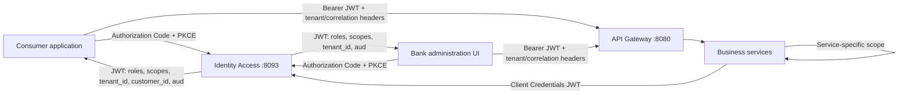

# Moneybags Authentication and Authorization

## Architecture

Moneybags uses one OAuth2/OpenID Connect issuer and validates the resulting JWT independently at every trust boundary.



The gateway is the public ingress, but it is not the only enforcement point. Every business service is also an OAuth2 resource server, validates issuer and audience, maps `roles` to Spring roles, enforces route scopes, and denies unmatched routes.

## Human roles

| Capability | `CONSUMER` | `BANK_ADMIN` |
|---|---|---|
| View products | Yes | Yes |
| Read/update CIF and KYC | Own customer only | Any customer; review decisions |
| Open/read/change deposit account or FD | Own customer/account only | Any account; lifecycle administration |
| Submit/read card applications and accounts | Own customer/account only | Decision and lifecycle administration |
| Create/read/cancel payments | Own customer/payment only | Any payment; operations administration |
| View notifications | Own customer only | Any customer |
| Accounting, product administration, user administration | No | Yes |

Scopes are still required in addition to the role. At token issuance, a `CONSUMER` principal's scope claim is intersected with the consumer whitelist. Therefore a consumer cannot obtain administrative scopes by initiating login through the admin client.

## Registered OAuth clients

- `moneybags-consumer`: public PKCE client with customer-facing scopes.
- `moneybags-admin`: public PKCE client with administration scopes.
- `cif-service`, `payments-service`, `deposit-account-service`, `credit-card-service`, `kyc-service`, and `notification-service`: confidential Client Credentials clients with only their peer-integration scopes.

## Authenticated CIF and KYC flow

1. The customer signs in through `moneybags-consumer` using Authorization Code with PKCE. The initial consumer JWT contains `user_id`, `tenant_id`, role `CONSUMER`, and consumer scopes. A newly provisioned identity may have no `customer_id` yet.
2. That unlinked consumer may call `POST /api/v1/cifs` once. CIF records the signed identity user and tenant; the request cannot choose either value. CIF then uses its own Client Credentials token to bind the generated CIF ID back to the identity record through the private `identity:service` API. The customer obtains a fresh token after this step so subsequent tokens contain `customer_id`.
3. CIF calls `POST /api/v1/kycs` with a Client Credentials token carrying `kyc:service`. A consumer token cannot create or replace a KYC snapshot. Replays for the same CIF return the existing immutable snapshot.
4. The consumer can read the KYC case and upload PAN, Aadhaar, address proof, and salary proof only when the signed `customer_id` owns the case and the signed tenant matches it.
5. A bank administrator with `kyc:review` uses `GET /api/v1/kycs/admin/work-queue`. Queue results and all direct case/document operations are restricted to the administrator's signed tenant.
6. Document review accepts only `VERIFIED` or `MISMATCH`. `verifiedBy` is taken from signed `user_id`, never from request JSON. A mismatch moves the case to `FLAGGED` but does not automatically reject it.
7. Final approval or rejection is allowed only after all four required documents exist and every document has been reviewed. `reviewedBy` is also taken from signed `user_id`; rejection requires a reason.
8. KYC uses its service token to update CIF. Failed CIF synchronization is persisted and retried automatically up to five times. KYC also calls Notification with `notification:service`; failed delivery is persisted and retried up to five times, while Notification keeps idempotent delivery attempts.

| API | Consumer | Bank admin | Service principal |
|---|---|---|---|
| `POST /api/v1/cifs` | Only while identity is unlinked | Yes | `cif:service` |
| `POST /api/v1/kycs` | No | No | CIF with `kyc:service` |
| `GET /api/v1/kycs/{id}` | Own CIF + tenant | Same tenant | `kyc:service` |
| `POST /api/v1/kycs/{id}/documents` | Own CIF + tenant | No | No |
| `PATCH .../verification` | No | Same tenant + `kyc:review` | No |
| `PATCH /api/v1/kycs/{id}/decision` | No | Same tenant + `kyc:review` | No |
| `GET /api/v1/kycs/admin/work-queue` | No | Signed tenant only | No |
| `POST /api/v1/kycs/{id}/sync` | No | No | `kyc:service` |

Human access tokens live for 10 minutes; refresh tokens live for 8 hours and rotate. Service access tokens live for 5 minutes. Client secrets are encoded at rest in the authorization-server registry. Production must provide the raw client secret through a secret manager as `M2M_CLIENT_SECRET`.

## Signed claims and request headers

Access tokens carry:

- `iss`: configured `OAUTH2_ISSUER_URI`.
- `aud`: `moneybags-api` by default.
- `sub` and `user_id`: user ID for humans, client ID for services.
- `roles`: `BANK_ADMIN`, `CONSUMER`, or an empty list for service principals.
- `tenant_id`: the tenant security boundary.
- `customer_id`: present for a consumer and used for object ownership checks.
- `scope`: explicitly authorized operations.

For gateway requests, clients must send:

- `Authorization: Bearer <token>`
- `X-Tenant-ID: <tenant_id from the token>`
- `X-Correlation-ID: <UUID>`

The gateway removes caller-supplied `X-User-ID`, `X-Customer-ID`, `X-Roles`, and `X-Authenticated-User`, then injects trusted identity values from the validated JWT. Gateway `/internal/**` and `/api/internal/**` paths are always denied.

## Local startup

1. Copy `.env.example` to `.env`.
2. Replace database passwords, `M2M_CLIENT_SECRET`, local user passwords, and mail credentials.
3. Start the reactor with `./run-all.ps1`.
4. Use the issuer discovery document at `http://localhost:8093/.well-known/openid-configuration`.

The local Identity profile uses H2 and creates:

- `admin@moneybags.local` with role `BANK_ADMIN`.
- `consumer@moneybags.local` with role `CONSUMER` and `customer_id=101`.

Do not use the local default passwords outside a developer workstation. `SECURITY_ENABLED=false` is intended only for isolated automated test profiles.

## Production checklist

- Use HTTPS end to end and expose only Gateway and the required OIDC endpoints.
- Generate a minimum 3072-bit RSA key pair and provide `IDENTITY_JWK_PUBLIC_KEY` and `IDENTITY_JWK_PRIVATE_KEY` through the secret manager.
- Use a long random M2M secret and rotate it. The current implementation shares one raw secret across service clients; move to per-client secrets or private-key JWT/mTLS before independent service-team deployment.
- Replace in-memory OAuth client registration with a governed persistent client store before dynamic client administration is required.
- Place Eureka and all `/internal/**` endpoints on private network segments; the gateway does not route them.
- Set exact CORS origins; do not use wildcard origins with credentials.
- Forward security events to the enterprise audit/SIEM platform and alert on repeated 401/403, locked users, and token failures.
- Revoke the previously committed SMTP app password and issue a new secret. The repository now reads mail credentials only from `MAIL_USERNAME` and `MAIL_PASSWORD`.
- Keep Liquibase as the only schema-change mechanism and back up the Identity schema before user-model migrations.

## Verification

Production sources compile with:

```powershell
mvn "-Dmaven.test.skip=true" compile
```

Focused authorization tests cover OAuth client scope separation, initial CIF registration, CIF/KYC customer and tenant ownership, trusted reviewer attribution, required-document decision gates, mismatch handling, notification retry attempts, deposit holder/primary-holder ownership, and administrator bypass.
