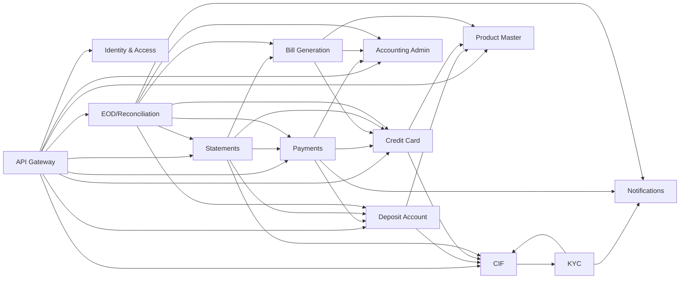

# Moneybags Complete Synchronous API Contract

Contract version 1.0.0 | 2026-08-11

This contract reconciles the supplied Moneybags scope and microservice API template with the implemented Deposit Account service. It is the canonical synchronous contract for service boundaries, API paths, request/response schemas, dependency calls, and Oracle schema ownership.

## Contract decisions

- Public and operator APIs use `/api/v1/**` and may be routed by the Gateway.
- Trusted peer APIs use `/internal/v1/**`, require service authentication, and are never routed publicly.
- Every mutable command accepts `Idempotency-Key`; aggregate updates also accept `If-Match` when concurrent edits are possible.
- Services own separate Oracle schemas. Cross-service reads occur only through APIs.
- Accounting is the financial book of record; account services maintain operational projections and holds.
- Synchronous consistency uses idempotent commands, bounded timeouts, retries only for safe operations, and explicit compensation states.

## Service and port map

| Service | Port | Oracle schema | Core ownership |
|---|---:|---|---|
| Discovery Server | 8761 | - | Eureka registry |
| API Gateway | 8080 | - | Public routing and edge controls |
| Identity and Access Service | 8082 | `MONEYBAGS_IDENTITY` | Users, application profiles, roles, permissions, menu definitions, and role assignments. |
| CIF / Customer Service | 8081 | `MONEYBAGS_CIF` | CIF identity, customer demographics, contact details, employment data, customer status, and the current KYC status snapshot. |
| KYC Service | 8083 | `MONEYBAGS_KYC` | KYC cases, customer snapshots used for review, document metadata/content references, verification results, and decisions. |
| Product Master Service | 8084 | `MONEYBAGS_PRODUCT` | Product definitions and versions, eligibility rules, fee rules, pricing, interest policies, card terms, and benchmarks. |
| Deposit Account Service | 8086 | `MONEYBAGS_DEPOSIT` | Deposit account identity and lifecycle, holder/nominee/mandate configuration, account-level limits, operational reservations, and balance read projections. |
| Credit Card Service | 8085 | `MONEYBAGS_CREDIT_CARD` | Card applications, approved limits, card account identity/status, available-limit projection, outstanding amount, and account-level interest snapshots. |
| Payments Service | 8087 | `MONEYBAGS_PAYMENT` | Payment requests, payment lifecycle, orchestration attempts, idempotency results, and peer-call outcome evidence. |
| Accounting Service | 8088 | `MONEYBAGS_ACCOUNTING` | Immutable journals and lines, reversals, GL master, rule versions, mappings, posting idempotency, account lifecycle projections, trial balances, financial reconciliation, and periods. |
| Bill Generation Service | 8092 | `MONEYBAGS_BILLING` | Billing cycles, bill headers, line items, calculation snapshots, bill status, and generation audit. |
| Statement Service | 8089 | `MONEYBAGS_STATEMENT` | Statement requests, generation status, immutable generated document metadata, file references, and generation audit. |
| Notification Service | 8090 | `MONEYBAGS_NOTIFICATION` | Notification templates, notification requests, channel payload snapshots, delivery attempts, and delivery status. |
| EOD / Reconciliation Orchestrator | 8091 | `MONEYBAGS_EOD` | Business date, EOD runs, step execution state, stable peer command references, orchestration exceptions, waivers, and close audit. |

## Synchronous dependency diagram

## Canonicalized paths

| Supplied/current path | Canonical path | Reason |
|---|---|---|
| `/api/products/**` | `/api/v1/products/**` | All public business APIs are versioned. |
| `/api/benchmarks/**` | `/api/v1/benchmarks/**` | Product reference APIs use the same version prefix. |
| `/api/internal/deposit-accounts/**` | `/internal/v1/deposit-accounts/**` | Peer APIs are direct-service routes and are never gateway-public. |
| `/api/v1/cifs/{cifId}/deposit-creation-details` | `/internal/v1/cifs/{cifId}/deposit-creation-details` | CIF eligibility snapshots are trusted peer contracts. |
| `/api/v1/cifs/{cifId}/credit-card-details` | `/internal/v1/cifs/{cifId}/credit-card-application-details` | Name states the exact consumer use case. |
| `/api/v1/cifs/{cifId}/customer-contact-details` | `/internal/v1/cifs/{cifId}/customer-contact-details` | PII-bearing contact data is peer-only. |
| `/internal/payments` | `/internal/v1/payments` | Internal APIs are versioned. |
| `/api/credit-cards/accounts/{accountId}/transactions/complete` | `/internal/v1/credit-card-accounts/{accountId}/purchase-postings` | Posting semantics replace an ambiguous complete command. |
| `/api/credit-cards/accounts/{accountId}/payments/complete` | `/internal/v1/credit-card-accounts/{accountId}/payment-postings` | Bill-payment projection is distinct from purchases. |
| `/api/v1/bills/generate` | `/internal/v1/bills/generate` | Bill generation is an EOD/operations command, not a customer API. |
| `/api/eod/**` | `/api/v1/eod/**` | EOD operator APIs follow the public version convention. |
| `/internal/** (Accounting)` | `/internal/v1/**` | Accounting peer APIs use the common internal prefix. |

## Workflow: CIF creation and KYC

1. Client creates CIF using POST /api/v1/cifs with Idempotency-Key.
2. CIF persists the customer, then calls KYC POST /api/v1/kycs using the same correlation ID.
3. Reviewers verify documents and decide the KYC case.
4. KYC calls CIF PATCH /internal/v1/cifs/{cifId}/kyc-status and Notification POST /internal/v1/notifications.

## Workflow: Deposit account opening

1. Deposit reads CIF /internal/v1/cifs/{cifId}/deposit-creation-details.
2. Deposit reads Product /api/v1/products/{productCode} and validates via /internal/v1/products/{productCode}/validate-account-opening.
3. Deposit persists the account aggregate, audit row, and idempotency result in one Oracle transaction.
4. No accounting journal is created merely for account identity creation; opening funding is a Payment command.

## Workflow: Book transfer

1. Payments validates both accounts through Deposit eligibility APIs and reserves source funds.
2. Payments posts the settlement fact to Accounting with the payment ID as the stable external reference.
3. After Journal POSTED, Payments calls Deposit /internal/v1/deposit-transfers and captures the reservation.
4. If projection settlement fails after accounting posts, Payments requests a journal reversal and releases the reservation.

## Workflow: Credit-card bill payment

1. Payments validates and reserves the source deposit account and validates destination card status/limit context.
2. Accounting posts the debit/credit journal.
3. Payments captures the source reservation and calls Card /payment-postings to reduce outstanding and restore limit.
4. Payments stores SETTLED only after accounting and both projections succeed; otherwise it enters REVERSAL_PENDING.

## Workflow: Statement generation

1. Statement verifies CIF ownership and reads the owning account service.
2. Deposit statements read Payments history; card statements also read Bill summaries and card account data.
3. The generated document is immutable and referenced by the Statement service.
4. Statement completion may request a notification; delivery failure does not invalidate the statement.

## Workflow: End-of-day closure

1. EOD freezes the business-date cutoff and sends stable commandReference values to each peer.
2. Payments cutoff/drain and Deposit/Card readiness must complete before Billing and financial controls.
3. Accounting produces a trial balance and Payments reconciliation; critical differences block closure.
4. Statements and Notifications run under explicit blocking/warning policies, then Accounting closes the period and EOD opens the next date.

## Identity and Access Service

Manages application users, profiles, roles, permissions, and role-derived menus. JWT issuance may be delegated to an enterprise authorization server, while this service remains the source for Moneybags application authorization data.

**Owns:** Users, application profiles, roles, permissions, menu definitions, and role assignments.

**Does not own:** CIF/customer records, KYC evidence, bank accounts, or financial transactions.

**Oracle schema:** `MONEYBAGS_IDENTITY`

| Visibility | Method | Canonical path | Purpose | Request -> response |
|---|---|---|---|---|
| public | `POST` | `/api/v1/users` | Register an application user | `CreateUserRequest -> UserResponse` |
| public | `GET` | `/api/v1/users/{userId}` | Get an application profile | `- -> UserResponse` |
| public | `PATCH` | `/api/v1/users/{userId}` | Update an application profile | `UpdateUserProfileRequest -> UserResponse` |
| admin | `PUT` | `/api/v1/users/{userId}/roles` | Replace user role assignments | `RoleAssignmentRequest -> UserResponse` |
| public | `GET` | `/api/v1/users/{userId}/menu` | Get the effective application menu | `- -> MenuResponse` |
| admin | `POST` | `/api/v1/roles` | Create a role and permissions | `RoleRequest -> RoleResponse` |
| admin | `GET` | `/api/v1/roles` | List roles | `- -> RolePage` |
| internal | `GET` | `/internal/v1/users/{userId}/authorization-context` | Resolve roles and permissions for a trusted caller | `- -> AuthorizationContext` |

### Oracle table blueprint

| Table | Purpose | Key columns and types | Keys / local relationships |
|---|---|---|---|
| `APP_USER` | Application login identity | USER_ID VARCHAR2(36) PK; USERNAME VARCHAR2(100); EMAIL VARCHAR2(254); STATUS VARCHAR2(20); VERSION_NO NUMBER; CREATED_AT/UPDATED_AT TIMESTAMP TZ | UQ(USERNAME), UQ(EMAIL) |
| `USER_PROFILE` | Moneybags application profile | USER_ID VARCHAR2(36) PK/FK; DISPLAY_NAME VARCHAR2(160); PHONE VARCHAR2(30); LOCALE VARCHAR2(10); TIME_ZONE VARCHAR2(50) | FK USER_ID -> APP_USER |
| `ROLE` | Role definition | ROLE_ID VARCHAR2(36) PK; ROLE_CODE VARCHAR2(50); NAME VARCHAR2(120); STATUS VARCHAR2(20); VERSION_NO NUMBER | UQ(ROLE_CODE) |
| `PERMISSION` | Permission definition | PERMISSION_ID VARCHAR2(36) PK; PERMISSION_CODE VARCHAR2(100); DESCRIPTION VARCHAR2(500) | UQ(PERMISSION_CODE) |
| `USER_ROLE` | User-to-role assignment | USER_ID VARCHAR2(36); ROLE_ID VARCHAR2(36); ASSIGNED_AT TIMESTAMP TZ; ASSIGNED_BY VARCHAR2(100) | PK(USER_ID,ROLE_ID); local FKs to APP_USER and ROLE |
| `ROLE_PERMISSION` | Role-to-permission assignment | ROLE_ID VARCHAR2(36); PERMISSION_ID VARCHAR2(36) | PK(ROLE_ID,PERMISSION_ID); local FKs |
| `MENU_ITEM` | Application navigation item | MENU_ID VARCHAR2(36) PK; PARENT_MENU_ID VARCHAR2(36); CODE/LABEL/PATH VARCHAR2; SORT_ORDER NUMBER; STATUS VARCHAR2(20) | Self FK PARENT_MENU_ID; UQ(CODE) |
| `ROLE_MENU` | Role-visible menu item | ROLE_ID VARCHAR2(36); MENU_ID VARCHAR2(36) | PK(ROLE_ID,MENU_ID); local FKs |

## CIF / Customer Service

Creates and maintains the bank customer record, contact data, customer classification, and the synchronized KYC status used by downstream account-opening services.

**Owns:** CIF identity, customer demographics, contact details, employment data, customer status, and the current KYC status snapshot.

**Does not own:** KYC documents or decisions, product rules, deposit accounts, credit-card accounts, or notification delivery.

**Oracle schema:** `MONEYBAGS_CIF`

| Visibility | Method | Canonical path | Purpose | Request -> response |
|---|---|---|---|---|
| public | `POST` | `/api/v1/cifs` | Create a customer and initiate KYC | `CreateCifRequest -> CifResponse` |
| public | `GET` | `/api/v1/cifs/{cifId}` | Get a customer | `- -> CifResponse` |
| admin | `GET` | `/api/v1/cifs` | Search customers | `- -> CifPage` |
| public | `PATCH` | `/api/v1/cifs/{cifId}` | Update allowed customer fields | `UpdateCifRequest -> CifResponse` |
| internal | `PATCH` | `/internal/v1/cifs/{cifId}/kyc-status` | Apply the final KYC status | `KycStatusUpdateRequest -> CifResponse` |
| internal | `GET` | `/internal/v1/cifs/{cifId}/deposit-creation-details` | Provide customer and KYC eligibility for deposit opening | `- -> DepositCreationDetails` |
| internal | `GET` | `/internal/v1/cifs/{cifId}/credit-card-application-details` | Provide customer and KYC eligibility for card application | `- -> CreditCardApplicationDetails` |
| internal | `GET` | `/internal/v1/cifs/{cifId}/customer-contact-details` | Provide notification-safe contact data | `- -> CustomerContactDetails` |
| internal | `GET` | `/internal/v1/cifs/{cifId}/ownership` | Confirm ownership of a referenced account | `- -> OwnershipResponse` |

### Oracle table blueprint

| Table | Purpose | Key columns and types | Keys / local relationships |
|---|---|---|---|
| `CIF` | Canonical customer record | CIF_ID VARCHAR2(36) PK; FIRST_NAME/LAST_NAME VARCHAR2; DOB DATE; CUSTOMER_TYPE VARCHAR2(30); PAN_HASH/AADHAAR_HASH VARCHAR2(64); STATUS VARCHAR2(20); KYC_STATUS VARCHAR2(20); VERSION_NO NUMBER; CREATED_AT/UPDATED_AT TIMESTAMP TZ | UQ(PAN_HASH), UQ(AADHAAR_HASH) |
| `CIF_ADDRESS` | Effective customer address | ADDRESS_ID VARCHAR2(36) PK; CIF_ID VARCHAR2(36) FK; TYPE VARCHAR2(20); ADDRESS_LINES/CITY/STATE/POSTAL_CODE/COUNTRY VARCHAR2; VALID_FROM/VALID_TO TIMESTAMP TZ | FK CIF_ID -> CIF |
| `CIF_CONTACT` | Customer contact and preference | CONTACT_ID VARCHAR2(36) PK; CIF_ID VARCHAR2(36) FK; EMAIL/PHONE VARCHAR2; PREFERRED_CHANNEL VARCHAR2(20); VERIFIED_FLAGS; UPDATED_AT TIMESTAMP TZ | FK CIF_ID -> CIF; UQ(CIF_ID, contact type/value) |
| `CIF_EMPLOYMENT` | Employment and income snapshot | EMPLOYMENT_ID VARCHAR2(36) PK; CIF_ID VARCHAR2(36) FK; EMPLOYMENT_TYPE VARCHAR2(30); EMPLOYER VARCHAR2(160); MONTHLY_INCOME NUMBER(19,4); CURRENCY CHAR(3); AS_OF DATE | FK CIF_ID -> CIF |
| `CIF_STATUS_HISTORY` | Immutable customer status changes | HISTORY_ID VARCHAR2(36) PK; CIF_ID VARCHAR2(36) FK; FROM_STATUS/TO_STATUS VARCHAR2; REASON_CODE VARCHAR2(40); CHANGED_AT TIMESTAMP TZ; CORRELATION_ID VARCHAR2(64) | FK CIF_ID -> CIF; IX(CIF_ID,CHANGED_AT) |
| `KYC_STATUS_SNAPSHOT` | Last KYC decision synchronized into CIF | CIF_ID VARCHAR2(36) PK/FK; KYC_ID VARCHAR2(36); STATUS VARCHAR2(20); REASON_CODE VARCHAR2(40); DECIDED_AT TIMESTAMP TZ; SOURCE_VERSION NUMBER | Local FK CIF_ID only; KYC_ID is opaque |

## KYC Service

Runs KYC cases from initiation through document upload, verification, review, and final decision, then synchronously updates the CIF KYC snapshot.

**Owns:** KYC cases, customer snapshots used for review, document metadata/content references, verification results, and decisions.

**Does not own:** The canonical customer record, notification delivery, account opening, or product eligibility rules.

**Oracle schema:** `MONEYBAGS_KYC`

| Visibility | Method | Canonical path | Purpose | Request -> response |
|---|---|---|---|---|
| public | `POST` | `/api/v1/kycs` | Initiate a KYC case | `KycInitiationRequest -> KycCaseResponse` |
| public | `GET` | `/api/v1/kycs/{kycId}` | Get a KYC case | `- -> KycCaseResponse` |
| admin | `GET` | `/api/v1/kycs` | Search KYC cases by CIF and status | `- -> KycCasePage` |
| public | `POST` | `/api/v1/kycs/{kycId}/documents` | Upload KYC document metadata and content | `KycDocumentUploadRequest -> KycDocumentResponse` |
| admin | `GET` | `/api/v1/kycs/{kycId}/documents` | List KYC document metadata | `- -> KycDocumentPage` |
| admin | `GET` | `/api/v1/kycs/{kycId}/documents/{documentId}` | Download or preview a KYC document | `- -> BinaryDocument` |
| admin | `PATCH` | `/api/v1/kycs/{kycId}/documents/{documentId}/verification` | Record document verification | `DocumentVerificationRequest -> KycDocumentResponse` |
| admin | `PATCH` | `/api/v1/kycs/{kycId}/decision` | Approve or reject the KYC case | `KycDecisionRequest -> KycCaseResponse` |

### Oracle table blueprint

| Table | Purpose | Key columns and types | Keys / local relationships |
|---|---|---|---|
| `KYC_CASE` | KYC workflow aggregate | KYC_ID VARCHAR2(36) PK; CIF_ID VARCHAR2(36); STATUS VARCHAR2(24); INITIATED_BY VARCHAR2(100); REVIEWED_BY VARCHAR2(100); VERSION_NO NUMBER; CREATED_AT/UPDATED_AT TIMESTAMP TZ | UQ active case per CIF; CIF_ID is opaque |
| `KYC_CUSTOMER_SNAPSHOT` | Immutable customer data used in review | SNAPSHOT_ID VARCHAR2(36) PK; KYC_ID VARCHAR2(36) FK; SNAPSHOT_JSON CLOB IS JSON; CAPTURED_AT TIMESTAMP TZ | FK KYC_ID -> KYC_CASE |
| `KYC_DOCUMENT` | Document metadata and encrypted content reference | DOCUMENT_ID VARCHAR2(36) PK; KYC_ID VARCHAR2(36) FK; DOCUMENT_TYPE VARCHAR2(30); FILE_NAME VARCHAR2(255); STORAGE_REFERENCE VARCHAR2(500); CONTENT_HASH VARCHAR2(64); STATUS VARCHAR2(24); UPLOADED_AT TIMESTAMP TZ | FK KYC_ID -> KYC_CASE; UQ(KYC_ID,DOCUMENT_TYPE,CONTENT_HASH) |
| `KYC_DOCUMENT_VERIFICATION` | Document verification decision | VERIFICATION_ID VARCHAR2(36) PK; DOCUMENT_ID VARCHAR2(36) FK; STATUS VARCHAR2(20); REMARKS VARCHAR2(1000); VERIFIED_BY VARCHAR2(100); VERIFIED_AT TIMESTAMP TZ | FK DOCUMENT_ID -> KYC_DOCUMENT |
| `KYC_DECISION` | Final KYC case decision | DECISION_ID VARCHAR2(36) PK; KYC_ID VARCHAR2(36) FK; DECISION VARCHAR2(20); REASON_CODE VARCHAR2(40); REMARKS VARCHAR2(1000); DECIDED_BY VARCHAR2(100); DECIDED_AT TIMESTAMP TZ | FK KYC_ID -> KYC_CASE; UQ(KYC_ID) |
| `IDEMPOTENCY_RECORD` | Local command replay protection | RECORD_ID VARCHAR2(36) PK; SCOPE VARCHAR2(100); KEY_HASH/REQUEST_HASH VARCHAR2(64); STATUS VARCHAR2(20); RESOURCE_ID VARCHAR2(100); HTTP_STATUS NUMBER(3); RESPONSE_BODY CLOB; CREATED_AT/EXPIRES_AT TIMESTAMP TZ | UQ(SCOPE,KEY_HASH) |
| `AUDIT_LOG` | Immutable service-local audit evidence | AUDIT_ID VARCHAR2(36) PK; AGGREGATE_ID VARCHAR2(100); ACTION VARCHAR2(80); OUTCOME VARCHAR2(20); ACTOR_ID/ACTOR_TYPE VARCHAR2; BEFORE_HASH/AFTER_HASH VARCHAR2(64); CORRELATION_ID VARCHAR2(64); OCCURRED_AT TIMESTAMP TZ | IX(AGGREGATE_ID,OCCURRED_AT) |

## Product Master Service

Defines reusable deposit and credit-card products, lifecycle, eligibility, pricing, effective-dated interest policies, fees, limits, and reference benchmarks.

**Owns:** Product definitions and versions, eligibility rules, fee rules, pricing, interest policies, card terms, and benchmarks.

**Does not own:** Customer/account state, balances, cards, transactions, bills, or journals.

**Oracle schema:** `MONEYBAGS_PRODUCT`

| Visibility | Method | Canonical path | Purpose | Request -> response |
|---|---|---|---|---|
| admin | `POST` | `/api/v1/products` | Create a draft product | `ProductRequest -> ProductResponse` |
| public | `GET` | `/api/v1/products` | Search and page products | `- -> ProductPage` |
| public | `GET` | `/api/v1/products/{productCode}` | Get the effective product definition | `- -> ProductResponse` |
| admin | `PUT` | `/api/v1/products/{productCode}` | Create a replacement product version | `ProductRequest -> ProductResponse` |
| admin | `PATCH` | `/api/v1/products/{productCode}/status` | Change product lifecycle status | `StatusChangeRequest -> ProductResponse` |
| admin | `DELETE` | `/api/v1/products/{productCode}` | Delete a draft or discontinue an unused product | `- -> NoContent` |
| public | `GET` | `/api/v1/products/active` | List all currently active products | `- -> ProductPage` |
| public | `GET` | `/api/v1/products/category/{category}` | List active products by category | `- -> ProductPage` |
| public | `GET` | `/api/v1/products/{productCode}/eligibility` | Get eligibility rules | `- -> EligibilityRulePage` |
| public | `GET` | `/api/v1/products/{productCode}/pricing` | Get effective fees, rates, and calculation rules | `- -> ProductPricingResponse` |
| internal | `POST` | `/internal/v1/products/{productCode}/validate-account-opening` | Validate a proposed deposit account opening | `AccountOpeningValidationRequest -> EligibilityDecision` |
| internal | `POST` | `/internal/v1/products/{productCode}/validate-credit-card-application` | Validate a proposed card application | `CreditCardValidationRequest -> EligibilityDecision` |
| admin | `POST` | `/api/v1/products/{productCode}/interest-policies` | Add an effective-dated interest policy | `InterestPolicyRequest -> InterestPolicyResponse` |
| public | `GET` | `/api/v1/products/{productCode}/interest-policies` | List interest-policy versions | `- -> InterestPolicyPage` |
| admin | `POST` | `/api/v1/benchmarks` | Publish an effective-dated benchmark | `BenchmarkRequest -> BenchmarkResponse` |
| public | `GET` | `/api/v1/benchmarks/{benchmarkCode}` | Get an effective benchmark | `- -> BenchmarkResponse` |
| public | `GET` | `/api/v1/benchmarks/{benchmarkCode}/history` | List benchmark history | `- -> BenchmarkPage` |

### Oracle table blueprint

| Table | Purpose | Key columns and types | Keys / local relationships |
|---|---|---|---|
| `PRODUCT` | Stable product identity | PRODUCT_ID VARCHAR2(36) PK; PRODUCT_CODE VARCHAR2(40); CATEGORY VARCHAR2(30); CURRENT_VERSION NUMBER; STATUS VARCHAR2(20); CREATED_AT TIMESTAMP TZ | UQ(PRODUCT_CODE) |
| `PRODUCT_VERSION` | Effective-dated product definition | PRODUCT_VERSION_ID VARCHAR2(36) PK; PRODUCT_ID VARCHAR2(36) FK; VERSION_NO NUMBER; NAME VARCHAR2(160); CURRENCY_CODE CHAR(3); EFFECTIVE_FROM/EFFECTIVE_TO DATE; DEFINITION_JSON CLOB IS JSON | FK PRODUCT_ID -> PRODUCT; UQ(PRODUCT_ID,VERSION_NO) |
| `PRODUCT_ELIGIBILITY_RULE` | Product eligibility rule | RULE_ID VARCHAR2(36) PK; PRODUCT_VERSION_ID VARCHAR2(36) FK; RULE_CODE VARCHAR2(60); RULE_TYPE VARCHAR2(30); PARAMETERS_JSON CLOB IS JSON; PRIORITY NUMBER; ACTIVE_FLAG CHAR(1) | FK PRODUCT_VERSION_ID -> PRODUCT_VERSION; UQ(version,rule code) |
| `PRODUCT_FEE` | Effective product fee | FEE_ID VARCHAR2(36) PK; PRODUCT_VERSION_ID VARCHAR2(36) FK; FEE_TYPE VARCHAR2(40); AMOUNT NUMBER(19,4); PERCENTAGE NUMBER(9,6); FREQUENCY VARCHAR2(20); ACTIVE_FLAG CHAR(1) | FK PRODUCT_VERSION_ID -> PRODUCT_VERSION |
| `PRODUCT_PRICING` | Rate/calculation configuration | PRICING_ID VARCHAR2(36) PK; PRODUCT_VERSION_ID VARCHAR2(36) FK; PRICING_MODE VARCHAR2(30); ANNUAL_RATE NUMBER(9,6); BENCHMARK_CODE VARCHAR2(40); SPREAD NUMBER(9,6); CALCULATION_METHOD VARCHAR2(30) | FK PRODUCT_VERSION_ID -> PRODUCT_VERSION |
| `INTEREST_POLICY` | Effective-dated interest policy | POLICY_ID VARCHAR2(36) PK; PRODUCT_ID VARCHAR2(36) FK; POLICY_VERSION VARCHAR2(20); POLICY_JSON CLOB IS JSON; EFFECTIVE_FROM/EFFECTIVE_TO DATE; STATUS VARCHAR2(20) | FK PRODUCT_ID -> PRODUCT; UQ(PRODUCT_ID,POLICY_VERSION) |
| `CREDIT_CARD_TERM` | Card-specific product terms | TERM_ID VARCHAR2(36) PK; PRODUCT_VERSION_ID VARCHAR2(36) FK; GRACE_DAYS NUMBER; MINIMUM_DUE_RULE CLOB IS JSON; LIMIT_RULE CLOB IS JSON; PURCHASE_RATE NUMBER(9,6) | FK PRODUCT_VERSION_ID -> PRODUCT_VERSION |
| `BENCHMARK_RATE` | Effective benchmark rate | BENCHMARK_ID VARCHAR2(36) PK; BENCHMARK_CODE VARCHAR2(40); ANNUAL_RATE NUMBER(9,6); EFFECTIVE_FROM/EFFECTIVE_TO DATE; CREATED_BY VARCHAR2(100) | UQ(BENCHMARK_CODE,EFFECTIVE_FROM) |
| `AUDIT_LOG` | Immutable service-local audit evidence | AUDIT_ID VARCHAR2(36) PK; AGGREGATE_ID VARCHAR2(100); ACTION VARCHAR2(80); OUTCOME VARCHAR2(20); ACTOR_ID/ACTOR_TYPE VARCHAR2; BEFORE_HASH/AFTER_HASH VARCHAR2(64); CORRELATION_ID VARCHAR2(64); OCCURRED_AT TIMESTAMP TZ | IX(AGGREGATE_ID,OCCURRED_AT) |

## Deposit Account Service

Opens and manages deposit accounts, holders, nominees, mandates, limits, lifecycle, balance projection, operational holds, and peer-service eligibility.

**Owns:** Deposit account identity and lifecycle, holder/nominee/mandate configuration, account-level limits, operational reservations, and balance read projections.

**Does not own:** Product rules, CIF/KYC truth, immutable accounting journals, payment orchestration, or statements.

**Oracle schema:** `MONEYBAGS_DEPOSIT`

| Visibility | Method | Canonical path | Purpose | Request -> response |
|---|---|---|---|---|
| public | `POST` | `/api/deposit-accounts` | Open a deposit account | `OpenDepositAccountRequest -> DepositAccountResponse` |
| public | `POST` | `/api/deposit-accounts/eligibility-check` | Validate opening without persistence | `DepositEligibilityRequest -> EligibilityDecision` |
| public | `GET` | `/api/deposit-accounts/{accountId}` | Get account details | `- -> DepositAccountResponse` |
| public | `GET` | `/api/deposit-accounts` | Search accounts | `- -> DepositAccountPage` |
| public | `GET` | `/api/deposit-accounts/{accountId}/balance` | Get the current balance projection | `- -> DepositBalanceResponse` |
| public | `GET` | `/api/deposit-accounts/{accountId}/status-history` | Get immutable lifecycle history | `- -> AccountStatusHistoryPage` |
| public | `POST` | `/api/deposit-accounts/{accountId}/holders` | Add an eligible holder | `HolderRequest -> DepositAccountResponse` |
| public | `DELETE` | `/api/deposit-accounts/{accountId}/holders/{cifId}` | Remove a non-primary holder | `- -> NoContent` |
| public | `PUT` | `/api/deposit-accounts/{accountId}/nominees` | Replace nominee instructions | `NomineeListRequest -> NomineePage` |
| public | `PUT` | `/api/deposit-accounts/{accountId}/limits/{limitType}` | Upsert an account limit | `AccountLimitRequest -> AccountLimitResponse` |
| public | `POST` | `/api/deposit-accounts/{accountId}/mandates` | Add an account mandate | `MandateRequest -> MandateResponse` |
| public | `DELETE` | `/api/deposit-accounts/{accountId}/mandates/{mandateId}` | Revoke a mandate | `- -> NoContent` |
| public | `POST` | `/api/deposit-accounts/{accountId}/commands/{command}` | Execute a guarded lifecycle transition | `AccountStatusCommand -> DepositAccountResponse` |
| internal | `GET` | `/internal/v1/deposit-accounts/{accountId}/eligibility` | Validate ownership, status, currency, limits, and balances | `- -> DepositAccountEligibility` |
| internal | `GET` | `/internal/v1/deposit-accounts/{accountId}` | Get a peer-safe deposit account snapshot | `- -> DepositAccountResponse` |
| internal | `POST` | `/internal/v1/deposit-accounts/{accountId}/reservations` | Reserve funds for a payment | `FundReservationRequest -> FundReservationResponse` |
| internal | `POST` | `/internal/v1/deposit-accounts/{accountId}/reservations/{reservationId}/capture` | Capture a reservation after accounting posts | `ReservationActionRequest -> FundReservationResponse` |
| internal | `POST` | `/internal/v1/deposit-accounts/{accountId}/reservations/{reservationId}/release` | Release a reservation after failure or cancellation | `ReservationActionRequest -> FundReservationResponse` |
| internal | `POST` | `/internal/v1/deposit-transfers` | Apply an atomic source/target balance projection update | `DepositTransferRequest -> DepositTransferResponse` |
| internal | `POST` | `/internal/v1/deposit-accounts/eod/accruals` | Run daily deposit accrual controls | `DepositAccrualRequest -> DepositAccrualResponse` |
| internal | `GET` | `/internal/v1/deposit-accounts/eod/readiness` | Report account blockers for daily close | `- -> ServiceReadinessResponse` |

### Oracle table blueprint

| Table | Purpose | Key columns and types | Keys / local relationships |
|---|---|---|---|
| `DEPOSIT_ACCOUNT` | Deposit account aggregate root | ACCOUNT_ID VARCHAR2(36) PK; ACCOUNT_NUMBER VARCHAR2(34); PRODUCT_CODE VARCHAR2(40); PRODUCT_VERSION NUMBER; PRODUCT_NAME_SNAPSHOT VARCHAR2(120); CURRENCY_CODE CHAR(3); STATUS VARCHAR2(24); BRANCH_ID VARCHAR2(36); OPERATING_INSTRUCTION VARCHAR2(30); VERSION_NO NUMBER; CREATED_AT/UPDATED_AT TIMESTAMP TZ | UQ(ACCOUNT_NUMBER); product references are opaque |
| `ACCOUNT_HOLDER` | Deposit account holder | HOLDER_ID VARCHAR2(36) PK; ACCOUNT_ID VARCHAR2(36) FK; CIF_ID VARCHAR2(36); HOLDER_ROLE VARCHAR2(16); AUTHORIZATION_TYPE VARCHAR2(30); OWNERSHIP_PCT NUMBER(5,2); STATUS VARCHAR2(16) | FK ACCOUNT_ID -> DEPOSIT_ACCOUNT; UQ(ACCOUNT_ID,CIF_ID) |
| `ACCOUNT_BALANCE` | Operational balance projection | ACCOUNT_ID VARCHAR2(36) PK/FK; CURRENCY_CODE CHAR(3); LEDGER_BALANCE/AVAILABLE_BALANCE/BLOCKED_AMOUNT NUMBER(19,4); PROJECTION_VERSION NUMBER; AS_OF TIMESTAMP TZ; SOURCE_REFERENCE VARCHAR2(100) | FK ACCOUNT_ID -> DEPOSIT_ACCOUNT; UQ(SOURCE_REFERENCE) |
| `ACCOUNT_NOMINEE` | Nominee instruction | NOMINEE_ID VARCHAR2(36) PK; ACCOUNT_ID VARCHAR2(36) FK; CIF_REFERENCE VARCHAR2(36); NAME_CIPHER CLOB; RELATIONSHIP_CODE VARCHAR2(30); ALLOCATION_PCT NUMBER(5,2); STATUS VARCHAR2(16) | FK ACCOUNT_ID -> DEPOSIT_ACCOUNT |
| `ACCOUNT_MANDATE` | Account mandate | MANDATE_ID VARCHAR2(36) PK; ACCOUNT_ID VARCHAR2(36) FK; AUTHORIZED_CIF_ID VARCHAR2(36); MANDATE_TYPE VARCHAR2(30); STATUS VARCHAR2(16); VALID_FROM/VALID_TO TIMESTAMP TZ | FK ACCOUNT_ID -> DEPOSIT_ACCOUNT |
| `ACCOUNT_LIMIT` | Effective account-level limit | LIMIT_ID VARCHAR2(36) PK; ACCOUNT_ID VARCHAR2(36) FK; LIMIT_TYPE VARCHAR2(40); AMOUNT NUMBER(19,4); CURRENCY_CODE CHAR(3); EFFECTIVE_FROM/EFFECTIVE_TO TIMESTAMP TZ; VERSION_NO NUMBER | FK ACCOUNT_ID -> DEPOSIT_ACCOUNT; IX(account,type,effective from) |
| `ACCOUNT_STATUS_HISTORY` | Immutable account lifecycle history | HISTORY_ID VARCHAR2(36) PK; ACCOUNT_ID VARCHAR2(36) FK; FROM_STATUS/TO_STATUS VARCHAR2(24); REASON_CODE VARCHAR2(40); CHANGED_BY VARCHAR2(100); CORRELATION_ID VARCHAR2(64); CHANGED_AT TIMESTAMP TZ | FK ACCOUNT_ID -> DEPOSIT_ACCOUNT |
| `FUND_RESERVATION` | Payment fund hold | RESERVATION_ID VARCHAR2(36) PK; ACCOUNT_ID VARCHAR2(36) FK; PAYMENT_ID VARCHAR2(36); AMOUNT NUMBER(19,4); CURRENCY_CODE CHAR(3); STATUS VARCHAR2(20); EXPIRES_AT TIMESTAMP TZ; VERSION_NO NUMBER | FK ACCOUNT_ID -> DEPOSIT_ACCOUNT; UQ(PAYMENT_ID) |
| `IDEMPOTENCY_RECORD` | Local command replay protection | RECORD_ID VARCHAR2(36) PK; SCOPE VARCHAR2(100); KEY_HASH/REQUEST_HASH VARCHAR2(64); STATUS VARCHAR2(20); RESOURCE_ID VARCHAR2(100); HTTP_STATUS NUMBER(3); RESPONSE_BODY CLOB; CREATED_AT/EXPIRES_AT TIMESTAMP TZ | UQ(SCOPE,KEY_HASH) |
| `AUDIT_LOG` | Immutable service-local audit evidence | AUDIT_ID VARCHAR2(36) PK; AGGREGATE_ID VARCHAR2(100); ACTION VARCHAR2(80); OUTCOME VARCHAR2(20); ACTOR_ID/ACTOR_TYPE VARCHAR2; BEFORE_HASH/AFTER_HASH VARCHAR2(64); CORRELATION_ID VARCHAR2(64); OCCURRED_AT TIMESTAMP TZ | IX(AGGREGATE_ID,OCCURRED_AT) |

## Credit Card Service

Processes credit-card applications and owns credit-card accounts, limits, outstanding state, and card-specific posting projections.

**Owns:** Card applications, approved limits, card account identity/status, available-limit projection, outstanding amount, and account-level interest snapshots.

**Does not own:** Product rules, CIF/KYC truth, payment orchestration, bills, statements, or accounting journals.

**Oracle schema:** `MONEYBAGS_CREDIT_CARD`

| Visibility | Method | Canonical path | Purpose | Request -> response |
|---|---|---|---|---|
| public | `POST` | `/api/v1/credit-card-applications` | Submit a credit-card application | `CreditCardApplicationRequest -> CreditCardApplicationResponse` |
| public | `GET` | `/api/v1/credit-card-applications/{applicationId}` | Get an application | `- -> CreditCardApplicationResponse` |
| admin | `GET` | `/api/v1/credit-card-applications` | Search applications | `- -> CreditCardApplicationPage` |
| admin | `POST` | `/api/v1/credit-card-applications/{applicationId}/approve` | Approve an application and limit | `CreditCardDecisionRequest -> CreditCardApplicationResponse` |
| admin | `POST` | `/api/v1/credit-card-applications/{applicationId}/reject` | Reject an application | `CreditCardDecisionRequest -> CreditCardApplicationResponse` |
| admin | `POST` | `/api/v1/credit-card-accounts` | Open an account for an approved application | `OpenCreditCardAccountRequest -> CreditCardAccountResponse` |
| public | `GET` | `/api/v1/credit-card-accounts/{accountId}` | Get a credit-card account | `- -> CreditCardAccountResponse` |
| public | `GET` | `/api/v1/credit-card-accounts` | Search accounts by CIF | `- -> CreditCardAccountPage` |
| internal | `GET` | `/internal/v1/credit-card-accounts/{accountId}` | Get a peer-safe credit-card account snapshot | `- -> CreditCardAccountResponse` |
| internal | `GET` | `/internal/v1/credit-card-accounts/{accountId}/available-limit` | Get current available limit | `- -> AvailableLimitResponse` |
| internal | `POST` | `/internal/v1/credit-card-accounts/{accountId}/purchase-postings` | Apply a completed purchase projection | `CardPurchasePostingRequest -> CreditCardAccountResponse` |
| internal | `POST` | `/internal/v1/credit-card-accounts/{accountId}/payment-postings` | Apply a completed bill payment projection | `CardPaymentPostingRequest -> CreditCardAccountResponse` |
| internal | `GET` | `/internal/v1/credit-card-accounts/{accountId}/interest-rate` | Get saved account-level interest rate | `- -> InterestRateResponse` |
| internal | `GET` | `/internal/v1/credit-card-accounts/eod/readiness` | Report card-account blockers for daily close | `- -> ServiceReadinessResponse` |

### Oracle table blueprint

| Table | Purpose | Key columns and types | Keys / local relationships |
|---|---|---|---|
| `CREDIT_CARD_APPLICATION` | Credit-card application aggregate | APPLICATION_ID VARCHAR2(36) PK; CIF_ID VARCHAR2(36); PRODUCT_CODE VARCHAR2(40); REQUESTED_LIMIT/APPROVED_LIMIT NUMBER(19,4); KYC_STATUS_SNAPSHOT VARCHAR2(20); ELIGIBILITY_STATUS VARCHAR2(20); STATUS VARCHAR2(20); VERSION_NO NUMBER; CREATED_AT/UPDATED_AT TIMESTAMP TZ | CIF/product references are opaque |
| `CREDIT_CARD_ACCOUNT` | Credit-card account aggregate | ACCOUNT_ID VARCHAR2(36) PK; APPLICATION_ID VARCHAR2(36) FK; CIF_ID VARCHAR2(36); PRODUCT_CODE VARCHAR2(40); CARD_TOKEN VARCHAR2(100); SANCTIONED_LIMIT/AVAILABLE_LIMIT/OUTSTANDING_AMOUNT NUMBER(19,4); PURCHASE_RATE_SNAPSHOT NUMBER(9,6); STATUS VARCHAR2(20); VERSION_NO NUMBER | FK APPLICATION_ID -> CREDIT_CARD_APPLICATION; UQ(CARD_TOKEN) |
| `CARD_STATUS_HISTORY` | Immutable card-account status history | HISTORY_ID VARCHAR2(36) PK; ACCOUNT_ID VARCHAR2(36) FK; FROM_STATUS/TO_STATUS VARCHAR2(20); REASON_CODE VARCHAR2(40); CHANGED_AT TIMESTAMP TZ; CORRELATION_ID VARCHAR2(64) | FK ACCOUNT_ID -> CREDIT_CARD_ACCOUNT |
| `CARD_ACCOUNT_POSTING` | Idempotent card projection posting | POSTING_ID VARCHAR2(36) PK; ACCOUNT_ID VARCHAR2(36) FK; PAYMENT_ID VARCHAR2(36); POSTING_TYPE VARCHAR2(30); AMOUNT NUMBER(19,4); JOURNAL_NUMBER VARCHAR2(60); OCCURRED_AT TIMESTAMP TZ | FK ACCOUNT_ID -> CREDIT_CARD_ACCOUNT; UQ(PAYMENT_ID,POSTING_TYPE) |
| `IDEMPOTENCY_RECORD` | Local command replay protection | RECORD_ID VARCHAR2(36) PK; SCOPE VARCHAR2(100); KEY_HASH/REQUEST_HASH VARCHAR2(64); STATUS VARCHAR2(20); RESOURCE_ID VARCHAR2(100); HTTP_STATUS NUMBER(3); RESPONSE_BODY CLOB; CREATED_AT/EXPIRES_AT TIMESTAMP TZ | UQ(SCOPE,KEY_HASH) |
| `AUDIT_LOG` | Immutable service-local audit evidence | AUDIT_ID VARCHAR2(36) PK; AGGREGATE_ID VARCHAR2(100); ACTION VARCHAR2(80); OUTCOME VARCHAR2(20); ACTOR_ID/ACTOR_TYPE VARCHAR2; BEFORE_HASH/AFTER_HASH VARCHAR2(64); CORRELATION_ID VARCHAR2(64); OCCURRED_AT TIMESTAMP TZ | IX(AGGREGATE_ID,OCCURRED_AT) |

## Payments Service

Orchestrates book transfers, credit-card payments, merchant payments, cancellation, settlement, reversal, and refund states through synchronous peer APIs.

**Owns:** Payment requests, payment lifecycle, orchestration attempts, idempotency results, and peer-call outcome evidence.

**Does not own:** Account balances, card limits, customer contacts, product rules, or accounting journals.

**Oracle schema:** `MONEYBAGS_PAYMENT`

| Visibility | Method | Canonical path | Purpose | Request -> response |
|---|---|---|---|---|
| public | `POST` | `/api/v1/payments` | Create and synchronously execute a payment | `CreatePaymentRequest -> PaymentResponse` |
| public | `GET` | `/api/v1/payments/{paymentId}` | Get payment status | `- -> PaymentResponse` |
| public | `POST` | `/api/v1/payments/{paymentId}/cancel` | Cancel a payment before settlement | `PaymentCancelRequest -> PaymentResponse` |
| internal | `GET` | `/internal/v1/payments` | Search settled and exceptional payments by account and date | `- -> PaymentPage` |
| internal | `POST` | `/internal/v1/payments/eod/cutoff` | Apply payment cutoff controls | `EodPaymentCommand -> EodPaymentResult` |
| internal | `POST` | `/internal/v1/payments/eod/drain` | Drain or classify in-flight payments | `EodPaymentCommand -> EodPaymentResult` |
| internal | `POST` | `/internal/v1/payments/{paymentId}/reversal` | Reverse a settled payment | `PaymentReversalRequest -> PaymentResponse` |

### Oracle table blueprint

| Table | Purpose | Key columns and types | Keys / local relationships |
|---|---|---|---|
| `PAYMENT` | Payment orchestration aggregate | PAYMENT_ID VARCHAR2(36) PK; PAYMENT_TYPE VARCHAR2(30); SOURCE_TYPE/SOURCE_ACCOUNT_ID VARCHAR2; DESTINATION_TYPE/DESTINATION_ACCOUNT_ID VARCHAR2; AMOUNT NUMBER(19,4); CURRENCY_CODE CHAR(3); STATUS VARCHAR2(30); JOURNAL_NUMBER VARCHAR2(60); REFERENCE VARCHAR2(255); VERSION_NO NUMBER; CREATED_AT/UPDATED_AT TIMESTAMP TZ | IX(source account,date), IX(destination account,date) |
| `PAYMENT_STATUS_HISTORY` | Immutable payment status changes | HISTORY_ID VARCHAR2(36) PK; PAYMENT_ID VARCHAR2(36) FK; FROM_STATUS/TO_STATUS VARCHAR2(30); REASON_CODE VARCHAR2(40); CORRELATION_ID VARCHAR2(64); CHANGED_AT TIMESTAMP TZ | FK PAYMENT_ID -> PAYMENT |
| `PAYMENT_ATTEMPT` | Peer-call attempt | ATTEMPT_ID VARCHAR2(36) PK; PAYMENT_ID VARCHAR2(36) FK; STEP_CODE VARCHAR2(40); ATTEMPT_NO NUMBER; OUTCOME VARCHAR2(20); HTTP_STATUS NUMBER(3); ERROR_CODE VARCHAR2(80); STARTED_AT/COMPLETED_AT TIMESTAMP TZ | FK PAYMENT_ID -> PAYMENT; UQ(payment,step,attempt) |
| `PAYMENT_PEER_RESULT` | Stable result of one orchestration step | RESULT_ID VARCHAR2(36) PK; PAYMENT_ID VARCHAR2(36) FK; STEP_CODE VARCHAR2(40); COMMAND_REFERENCE VARCHAR2(100); PROVIDER_SERVICE VARCHAR2(80); RESOURCE_REFERENCE VARCHAR2(100); RESPONSE_HASH VARCHAR2(64); COMPLETED_AT TIMESTAMP TZ | FK PAYMENT_ID -> PAYMENT; UQ(COMMAND_REFERENCE) |
| `IDEMPOTENCY_RECORD` | Local command replay protection | RECORD_ID VARCHAR2(36) PK; SCOPE VARCHAR2(100); KEY_HASH/REQUEST_HASH VARCHAR2(64); STATUS VARCHAR2(20); RESOURCE_ID VARCHAR2(100); HTTP_STATUS NUMBER(3); RESPONSE_BODY CLOB; CREATED_AT/EXPIRES_AT TIMESTAMP TZ | UQ(SCOPE,KEY_HASH) |
| `AUDIT_LOG` | Immutable service-local audit evidence | AUDIT_ID VARCHAR2(36) PK; AGGREGATE_ID VARCHAR2(100); ACTION VARCHAR2(80); OUTCOME VARCHAR2(20); ACTOR_ID/ACTOR_TYPE VARCHAR2; BEFORE_HASH/AFTER_HASH VARCHAR2(64); CORRELATION_ID VARCHAR2(64); OCCURRED_AT TIMESTAMP TZ | IX(AGGREGATE_ID,OCCURRED_AT) |

## Accounting Service

Maintains the authoritative double-entry record, accounting rules, GL accounts, subledger mappings, journals, trial balances, financial reconciliation, and accounting periods.

**Owns:** Immutable journals and lines, reversals, GL master, rule versions, mappings, posting idempotency, Accounting lifecycle projections, trial balances, financial reconciliation, and periods.

**Does not own:** Payment lifecycle, customer/account truth, product definitions, bills, statements, or EOD orchestration.

**Oracle schema:** `MONEYBAGS_ACCOUNTING`

| Visibility | Method | Canonical path | Purpose | Request -> response |
|---|---|---|---|---|
| internal | `POST` | `/internal/v1/payment-postings/settlements` | Post a settled payment fact | `PaymentSettlementPostingRequest -> JournalResponse` |
| internal | `POST` | `/internal/v1/payment-postings/refunds` | Post a completed refund fact | `PaymentRefundPostingRequest -> JournalResponse` |
| internal | `GET` | `/internal/v1/payment-postings/by-reference/{externalReference}` | Resolve an uncertain posting outcome | `- -> PostingOutcomeResponse` |
| internal | `POST` | `/internal/v1/fixed-deposit-postings` | Post a typed fixed-deposit financial fact | `FixedDepositPostingRequest -> JournalResponse` |
| internal | `POST` | `/internal/v1/fixed-deposit-postings/{operation}` | Compatibility aliases for funding, accrual, payout, maturity, and premature closure | `FixedDepositPostingRequest -> JournalResponse` |
| internal | `GET` | `/internal/v1/fixed-deposit-postings/by-reference/{postingReference}` | Resolve an uncertain fixed-deposit posting outcome | `- -> PostingOutcomeResponse` |
| internal | `POST` | `/internal/v1/account-lifecycle-events` | Register a Deposit or Credit Card opening/closing fact without creating a journal | `AccountLifecycleEventRequest -> AccountLifecycleResponse` |
| internal | `GET` | `/internal/v1/account-clearances/{accountType}/{accountReference}` | Check Accounting-owned balances and closure blockers | `- -> AccountClearanceResponse` |
| internal | `GET` | `/internal/v1/account-balances/{accountReference}` | Get an authoritative journal-derived account balance | `- -> AccountBalanceResponse` |
| internal | `GET` | `/internal/v1/ledger-entries` | List journal lines for an account and date range | `- -> LedgerEntryPage` |
| internal | `POST` | `/internal/v1/bill-postings` | Post bill fees and interest as an immutable journal | `BillAccountingPostingRequest -> JournalResponse` |
| internal | `POST` | `/internal/v1/journals/{journalNumber}/reversals` | Create an immutable opposite journal | `JournalReversalRequest -> JournalResponse` |
| admin | `GET` | `/api/v1/journals/{journalNumber}` | Get a journal and lines | `- -> JournalResponse` |
| admin | `GET` | `/api/v1/journals` | Search journals | `- -> JournalPage` |
| admin | `POST` | `/api/v1/gl-accounts` | Create a GL account | `GlAccountRequest -> GlAccountResponse` |
| admin | `GET` | `/api/v1/gl-accounts` | List GL accounts | `- -> GlAccountPage` |
| admin | `GET` | `/api/v1/gl-accounts/{glCode}` | Get a GL account | `- -> GlAccountResponse` |
| admin | `PATCH` | `/api/v1/gl-accounts/{glCode}/status` | Activate or deactivate a GL account | `StatusChangeRequest -> GlAccountResponse` |
| admin | `POST` | `/api/v1/accounting-rules` | Create an effective-dated rule version | `AccountingRuleRequest -> AccountingRuleResponse` |
| admin | `GET` | `/api/v1/accounting-rules` | List accounting-rule versions | `- -> AccountingRulePage` |
| admin | `POST` | `/api/v1/subledger-mappings` | Create a subledger-to-GL mapping | `SubledgerMappingRequest -> SubledgerMappingResponse` |
| admin | `GET` | `/api/v1/subledger-mappings` | List subledger mappings | `- -> SubledgerMappingPage` |
| internal | `POST` | `/internal/v1/trial-balances` | Generate and persist a trial balance | `TrialBalanceRequest -> TrialBalanceResponse` |
| admin | `GET` | `/api/v1/trial-balances/{runId}` | Get a persisted trial balance | `- -> TrialBalanceResponse` |
| internal | `POST` | `/internal/v1/eod/reconciliation/runs` | Run Payments-to-Accounting financial reconciliation | `FinancialReconciliationRequest -> FinancialReconciliationResponse` |
| admin | `GET` | `/api/v1/reconciliation/runs/{runId}` | Get financial reconciliation and exceptions | `- -> FinancialReconciliationResponse` |
| admin | `PATCH` | `/api/v1/reconciliation/runs/{runId}/items/{itemId}/resolution` | Resolve a financial reconciliation item | `ReconciliationResolutionRequest -> FinancialReconciliationResponse` |
| internal | `POST` | `/internal/v1/accounting-periods/{businessDate}/open` | Open an accounting period | `AccountingPeriodCommand -> AccountingPeriodResponse` |
| internal | `POST` | `/internal/v1/accounting-periods/{businessDate}/close` | Close an accounting period | `AccountingPeriodCommand -> AccountingPeriodResponse` |
| admin | `GET` | `/api/v1/accounting-periods/{businessDate}` | Get accounting-period status | `- -> AccountingPeriodResponse` |

### Oracle table blueprint

| Table | Purpose | Key columns and types | Keys / local relationships |
|---|---|---|---|
| `GL_ACCOUNT` | General-ledger account master | GL_ACCOUNT_ID VARCHAR2(36) PK; GL_CODE VARCHAR2(40); NAME VARCHAR2(160); ACCOUNT_TYPE VARCHAR2(20); NORMAL_BALANCE VARCHAR2(10); CURRENCY_CODE CHAR(3); PARENT_GL_CODE VARCHAR2(40); STATUS VARCHAR2(20); VERSION_NO NUMBER | UQ(GL_CODE); optional self-reference by code |
| `ACCOUNTING_RULE` | Effective-dated double-entry rule | RULE_ID VARCHAR2(36) PK; RULE_CODE VARCHAR2(60); EVENT_TYPE VARCHAR2(60); COMPONENT_TYPE VARCHAR2(40); PRODUCT_CODE VARCHAR2(40); CURRENCY_CODE CHAR(3); VERSION_NO NUMBER; DEBIT_MAPPING_CODE/CREDIT_MAPPING_CODE VARCHAR2(60); EFFECTIVE_FROM/EFFECTIVE_TO DATE; STATUS VARCHAR2(20) | UQ(RULE_CODE,VERSION_NO) |
| `SUBLEDGER_MAPPING` | Logical posting role to GL mapping | MAPPING_ID VARCHAR2(36) PK; MAPPING_CODE VARCHAR2(60); PRODUCT_CODE VARCHAR2(40); CURRENCY_CODE CHAR(3); GL_CODE VARCHAR2(40); EFFECTIVE_FROM/EFFECTIVE_TO DATE; STATUS VARCHAR2(20) | Local FK GL_CODE -> GL_ACCOUNT; UQ(mapping,product,currency,effective from) |
| `POSTING_REQUEST` | Financial posting idempotency/control | POSTING_REQUEST_ID VARCHAR2(36) PK; EXTERNAL_REFERENCE VARCHAR2(160); REQUEST_HASH VARCHAR2(64); SOURCE_SERVICE VARCHAR2(80); EVENT_TYPE VARCHAR2(60); STATUS VARCHAR2(20); JOURNAL_NUMBER VARCHAR2(60); RECEIVED_AT/COMPLETED_AT TIMESTAMP TZ | UQ(EXTERNAL_REFERENCE) |
| `JOURNAL` | Immutable balanced journal header | JOURNAL_ID VARCHAR2(36) PK; JOURNAL_NUMBER VARCHAR2(60); EXTERNAL_REFERENCE VARCHAR2(160); SOURCE_SERVICE VARCHAR2(80); EVENT_TYPE VARCHAR2(60); BUSINESS_DATE DATE; CURRENCY_CODE CHAR(3); STATUS VARCHAR2(20); TOTAL_DEBIT/TOTAL_CREDIT NUMBER(19,4); REVERSES_JOURNAL_ID VARCHAR2(36); POSTED_AT TIMESTAMP TZ | UQ(JOURNAL_NUMBER), UQ(EXTERNAL_REFERENCE); self FK reversal |
| `JOURNAL_LINE` | Immutable journal debit/credit line | LINE_ID VARCHAR2(36) PK; JOURNAL_ID VARCHAR2(36) FK; LINE_NUMBER NUMBER; GL_CODE VARCHAR2(40); SUBLEDGER_REFERENCE VARCHAR2(100); DEBIT_AMOUNT/CREDIT_AMOUNT NUMBER(19,4); NARRATION VARCHAR2(500) | FK JOURNAL_ID -> JOURNAL; local FK GL_CODE; UQ(journal,line) |
| `TRIAL_BALANCE_RUN` | Persisted trial-balance run | RUN_ID VARCHAR2(36) PK; BUSINESS_DATE DATE; CURRENCY_CODE CHAR(3); TOTAL_DEBIT/TOTAL_CREDIT NUMBER(19,4); BALANCED_FLAG CHAR(1); GENERATED_BY VARCHAR2(100); GENERATED_AT TIMESTAMP TZ | UQ(BUSINESS_DATE,CURRENCY_CODE) |
| `TRIAL_BALANCE_LINE` | Trial balance by GL | LINE_ID VARCHAR2(36) PK; RUN_ID VARCHAR2(36) FK; GL_CODE VARCHAR2(40); DEBIT_TOTAL/CREDIT_TOTAL/CLOSING_BALANCE NUMBER(19,4) | FK RUN_ID -> TRIAL_BALANCE_RUN; UQ(RUN_ID,GL_CODE) |
| `FIN_RECON_RUN` | Payments-to-Accounting reconciliation run | RUN_ID VARCHAR2(36) PK; EOD_RUN_ID VARCHAR2(80); BUSINESS_DATE DATE; CURRENCY_CODE CHAR(3); EXPECTED/ACTUAL_COUNTS NUMBER; EXPECTED/ACTUAL_TOTALS NUMBER(19,4); STATUS VARCHAR2(20); VERSION_NO NUMBER | UQ(EOD_RUN_ID,CURRENCY_CODE) |
| `FIN_RECON_ITEM` | Financial reconciliation exception item | ITEM_ID VARCHAR2(36) PK; RUN_ID VARCHAR2(36) FK; REFERENCE VARCHAR2(160); EXPECTED_AMOUNT/ACTUAL_AMOUNT/DIFFERENCE NUMBER(19,4); BLOCKING_FLAG CHAR(1); STATUS VARCHAR2(20); RESOLUTION VARCHAR2(1000) | FK RUN_ID -> FIN_RECON_RUN |
| `ACCOUNTING_PERIOD` | Accounting business-date state | PERIOD_ID VARCHAR2(36) PK; BUSINESS_DATE DATE; STATUS VARCHAR2(20); OPENED_AT/CLOSED_AT TIMESTAMP TZ; OPENED_BY/CLOSED_BY VARCHAR2(100); VERSION_NO NUMBER | UQ(BUSINESS_DATE) |
| `IDEMPOTENCY_RECORD` | Local command replay protection | RECORD_ID VARCHAR2(36) PK; SCOPE VARCHAR2(100); KEY_HASH/REQUEST_HASH VARCHAR2(64); STATUS VARCHAR2(20); RESOURCE_ID VARCHAR2(100); HTTP_STATUS NUMBER(3); RESPONSE_BODY CLOB; CREATED_AT/EXPIRES_AT TIMESTAMP TZ | UQ(SCOPE,KEY_HASH) |
| `AUDIT_LOG` | Immutable service-local audit evidence | AUDIT_ID VARCHAR2(36) PK; AGGREGATE_ID VARCHAR2(100); ACTION VARCHAR2(80); OUTCOME VARCHAR2(20); ACTOR_ID/ACTOR_TYPE VARCHAR2; BEFORE_HASH/AFTER_HASH VARCHAR2(64); CORRELATION_ID VARCHAR2(64); OCCURRED_AT TIMESTAMP TZ | IX(AGGREGATE_ID,OCCURRED_AT) |

## Bill Generation Service

Generates immutable credit-card bills from product rules, card snapshots, and authoritative financial activity, then exposes bill summaries to statements and payments.

**Owns:** Billing cycles, bill headers, line items, calculation snapshots, bill status, and generation audit.

**Does not own:** Card-account truth, product rules, accounting journals, customer contacts, statements, or notification delivery.

**Oracle schema:** `MONEYBAGS_BILLING`

| Visibility | Method | Canonical path | Purpose | Request -> response |
|---|---|---|---|---|
| internal | `POST` | `/internal/v1/bills/generate` | Generate a bill for an account and period | `BillGenerationRequest -> BillResponse` |
| public | `GET` | `/api/v1/bills/{billId}` | Get a bill | `- -> BillResponse` |
| internal | `GET` | `/internal/v1/bills` | Find bills by account and billing period | `- -> BillPage` |
| internal | `GET` | `/internal/v1/bills/{billId}/summary` | Get a statement-safe bill summary | `- -> BillSummaryResponse` |
| internal | `POST` | `/internal/v1/bills/eod/close` | Complete or classify daily bill generation | `BillCloseRequest -> BillCloseResponse` |

### Oracle table blueprint

| Table | Purpose | Key columns and types | Keys / local relationships |
|---|---|---|---|
| `BILLING_CYCLE` | Credit-card billing-cycle configuration | CYCLE_ID VARCHAR2(36) PK; CYCLE_CODE VARCHAR2(30); CUT_OFF_DAY NUMBER; DUE_DAYS NUMBER; STATUS VARCHAR2(20) | UQ(CYCLE_CODE) |
| `BILL` | Immutable generated bill header | BILL_ID VARCHAR2(36) PK; ACCOUNT_ID VARCHAR2(36); PRODUCT_CODE VARCHAR2(40); BILLING_PERIOD VARCHAR2(20); BUSINESS_DATE DATE; STATUS VARCHAR2(20); PREVIOUS_BALANCE/TOTAL_DUE/MINIMUM_DUE NUMBER(19,4); PAYMENT_DUE_DATE DATE; VERSION_NO NUMBER; GENERATED_AT TIMESTAMP TZ | UQ(ACCOUNT_ID,BILLING_PERIOD); account is opaque |
| `BILL_LINE` | Bill transaction/calculation line | LINE_ID VARCHAR2(36) PK; BILL_ID VARCHAR2(36) FK; LINE_TYPE VARCHAR2(30); SOURCE_REFERENCE VARCHAR2(160); DESCRIPTION VARCHAR2(500); AMOUNT NUMBER(19,4); OCCURRED_AT TIMESTAMP TZ | FK BILL_ID -> BILL; UQ(BILL_ID,SOURCE_REFERENCE,LINE_TYPE) |
| `BILL_CALCULATION_SNAPSHOT` | Rules and rates frozen into a bill | SNAPSHOT_ID VARCHAR2(36) PK; BILL_ID VARCHAR2(36) FK; PRODUCT_VERSION NUMBER; INTEREST_POLICY_VERSION VARCHAR2(30); RATE_SNAPSHOT NUMBER(9,6); FEE_RULES_JSON CLOB IS JSON; CALCULATED_AT TIMESTAMP TZ | FK BILL_ID -> BILL; UQ(BILL_ID) |
| `BILL_STATUS_HISTORY` | Immutable bill status changes | HISTORY_ID VARCHAR2(36) PK; BILL_ID VARCHAR2(36) FK; FROM_STATUS/TO_STATUS VARCHAR2(20); REASON_CODE VARCHAR2(40); CHANGED_AT TIMESTAMP TZ | FK BILL_ID -> BILL |
| `IDEMPOTENCY_RECORD` | Local command replay protection | RECORD_ID VARCHAR2(36) PK; SCOPE VARCHAR2(100); KEY_HASH/REQUEST_HASH VARCHAR2(64); STATUS VARCHAR2(20); RESOURCE_ID VARCHAR2(100); HTTP_STATUS NUMBER(3); RESPONSE_BODY CLOB; CREATED_AT/EXPIRES_AT TIMESTAMP TZ | UQ(SCOPE,KEY_HASH) |
| `AUDIT_LOG` | Immutable service-local audit evidence | AUDIT_ID VARCHAR2(36) PK; AGGREGATE_ID VARCHAR2(100); ACTION VARCHAR2(80); OUTCOME VARCHAR2(20); ACTOR_ID/ACTOR_TYPE VARCHAR2; BEFORE_HASH/AFTER_HASH VARCHAR2(64); CORRELATION_ID VARCHAR2(64); OCCURRED_AT TIMESTAMP TZ | IX(AGGREGATE_ID,OCCURRED_AT) |

## Statement Service

Builds downloadable deposit-account and credit-card statements from authoritative account, payment, bill, and customer-contact APIs.

**Owns:** Statement requests, generation status, immutable generated document metadata, file references, and generation audit.

**Does not own:** Accounts, payments, bills, accounting journals, customer truth, or notification delivery.

**Oracle schema:** `MONEYBAGS_STATEMENT`

| Visibility | Method | Canonical path | Purpose | Request -> response |
|---|---|---|---|---|
| public | `POST` | `/api/v1/statements` | Request a statement | `StatementRequest -> StatementResponse` |
| public | `GET` | `/api/v1/statements/{statementId}` | Get statement generation status | `- -> StatementResponse` |
| public | `GET` | `/api/v1/statements/{statementId}/download` | Download a generated statement | `- -> BinaryDocument` |
| internal | `POST` | `/internal/v1/statements/eod/generate` | Generate scheduled statements and account summaries | `EodStatementRequest -> EodStatementResponse` |

### Oracle table blueprint

| Table | Purpose | Key columns and types | Keys / local relationships |
|---|---|---|---|
| `STATEMENT_REQUEST` | Statement request aggregate | STATEMENT_ID VARCHAR2(36) PK; CIF_ID VARCHAR2(36); ACCOUNT_ID VARCHAR2(36); ACCOUNT_TYPE VARCHAR2(30); FROM_DATE/TO_DATE DATE; FORMAT VARCHAR2(10); STATUS VARCHAR2(20); ERROR_CODE VARCHAR2(80); REQUESTED_AT/GENERATED_AT TIMESTAMP TZ; VERSION_NO NUMBER | UQ idempotency scope/key; CIF/account are opaque |
| `STATEMENT_DOCUMENT` | Immutable generated statement file | DOCUMENT_ID VARCHAR2(36) PK; STATEMENT_ID VARCHAR2(36) FK; FILE_NAME VARCHAR2(255); FILE_FORMAT VARCHAR2(10); STORAGE_REFERENCE VARCHAR2(500); CONTENT_HASH VARCHAR2(64); FILE_SIZE NUMBER; CREATED_AT TIMESTAMP TZ | FK STATEMENT_ID -> STATEMENT_REQUEST; UQ(STATEMENT_ID) |
| `STATEMENT_GENERATION_ATTEMPT` | Statement generation attempt | ATTEMPT_ID VARCHAR2(36) PK; STATEMENT_ID VARCHAR2(36) FK; ATTEMPT_NO NUMBER; STATUS VARCHAR2(20); ERROR_CODE/ERROR_MESSAGE VARCHAR2; STARTED_AT/COMPLETED_AT TIMESTAMP TZ | FK STATEMENT_ID -> STATEMENT_REQUEST; UQ(statement,attempt) |
| `IDEMPOTENCY_RECORD` | Local command replay protection | RECORD_ID VARCHAR2(36) PK; SCOPE VARCHAR2(100); KEY_HASH/REQUEST_HASH VARCHAR2(64); STATUS VARCHAR2(20); RESOURCE_ID VARCHAR2(100); HTTP_STATUS NUMBER(3); RESPONSE_BODY CLOB; CREATED_AT/EXPIRES_AT TIMESTAMP TZ | UQ(SCOPE,KEY_HASH) |
| `AUDIT_LOG` | Immutable service-local audit evidence | AUDIT_ID VARCHAR2(36) PK; AGGREGATE_ID VARCHAR2(100); ACTION VARCHAR2(80); OUTCOME VARCHAR2(20); ACTOR_ID/ACTOR_TYPE VARCHAR2; BEFORE_HASH/AFTER_HASH VARCHAR2(64); CORRELATION_ID VARCHAR2(64); OCCURRED_AT TIMESTAMP TZ | IX(AGGREGATE_ID,OCCURRED_AT) |

## Notification Service

Creates and delivers templated email/SMS/in-app notifications for peer services and exposes a customer notification inbox.

**Owns:** Notification templates, notification requests, channel payload snapshots, delivery attempts, and delivery status.

**Does not own:** Customer contact truth, source business records, statements, bills, payments, or KYC decisions.

**Oracle schema:** `MONEYBAGS_NOTIFICATION`

| Visibility | Method | Canonical path | Purpose | Request -> response |
|---|---|---|---|---|
| internal | `POST` | `/internal/v1/notifications` | Create and attempt a notification | `NotificationRequest -> NotificationResponse` |
| public | `GET` | `/api/v1/notifications` | List notifications for the authenticated CIF | `- -> NotificationPage` |
| public | `GET` | `/api/v1/notifications/{notificationId}` | Get notification status and safe content | `- -> NotificationResponse` |

### Oracle table blueprint

| Table | Purpose | Key columns and types | Keys / local relationships |
|---|---|---|---|
| `NOTIFICATION_TEMPLATE` | Versioned notification template | TEMPLATE_ID VARCHAR2(36) PK; TEMPLATE_CODE VARCHAR2(60); CHANNEL VARCHAR2(20); VERSION_NO NUMBER; SUBJECT_TEMPLATE VARCHAR2(500); BODY_TEMPLATE CLOB; STATUS VARCHAR2(20) | UQ(TEMPLATE_CODE,CHANNEL,VERSION_NO) |
| `NOTIFICATION` | Notification request and rendered snapshot | NOTIFICATION_ID VARCHAR2(36) PK; CIF_ID VARCHAR2(36); TYPE VARCHAR2(40); REFERENCE_TYPE/REFERENCE_ID VARCHAR2; TEMPLATE_CODE VARCHAR2(60); RENDERED_SUBJECT VARCHAR2(500); RENDERED_BODY CLOB; STATUS VARCHAR2(20); CORRELATION_ID VARCHAR2(64); CREATED_AT/SENT_AT TIMESTAMP TZ | UQ(source reference,type); CIF is opaque |
| `DELIVERY_ATTEMPT` | Channel delivery attempt | ATTEMPT_ID VARCHAR2(36) PK; NOTIFICATION_ID VARCHAR2(36) FK; ATTEMPT_NO NUMBER; CHANNEL VARCHAR2(20); PROVIDER VARCHAR2(40); STATUS VARCHAR2(20); PROVIDER_REFERENCE VARCHAR2(160); ERROR_CODE/ERROR_MESSAGE VARCHAR2; ATTEMPTED_AT TIMESTAMP TZ | FK NOTIFICATION_ID -> NOTIFICATION; UQ(notification,channel,attempt) |
| `IDEMPOTENCY_RECORD` | Local command replay protection | RECORD_ID VARCHAR2(36) PK; SCOPE VARCHAR2(100); KEY_HASH/REQUEST_HASH VARCHAR2(64); STATUS VARCHAR2(20); RESOURCE_ID VARCHAR2(100); HTTP_STATUS NUMBER(3); RESPONSE_BODY CLOB; CREATED_AT/EXPIRES_AT TIMESTAMP TZ | UQ(SCOPE,KEY_HASH) |
| `AUDIT_LOG` | Immutable service-local audit evidence | AUDIT_ID VARCHAR2(36) PK; AGGREGATE_ID VARCHAR2(100); ACTION VARCHAR2(80); OUTCOME VARCHAR2(20); ACTOR_ID/ACTOR_TYPE VARCHAR2; BEFORE_HASH/AFTER_HASH VARCHAR2(64); CORRELATION_ID VARCHAR2(64); OCCURRED_AT TIMESTAMP TZ | IX(AGGREGATE_ID,OCCURRED_AT) |

## EOD / Reconciliation Orchestrator

Coordinates the business date and ordered synchronous end-of-day controls across Payments, Deposit, Credit Card, Billing, Accounting, Statements, and Notifications.

**Owns:** Business date, EOD runs, step execution state, stable peer command references, orchestration exceptions, waivers, and close audit.

**Does not own:** Peer-service business records, journals, account status, bill content, statements, or notifications.

**Oracle schema:** `MONEYBAGS_EOD`

| Visibility | Method | Canonical path | Purpose | Request -> response |
|---|---|---|---|---|
| public | `GET` | `/api/v1/business-date` | Get the current business date and cutoff state | `- -> BusinessDateResponse` |
| admin | `POST` | `/api/v1/eod/runs` | Start one EOD run for a business date | `StartEodRunRequest -> EodRunResponse` |
| admin | `GET` | `/api/v1/eod/runs/{runId}` | Get EOD run and step status | `- -> EodRunResponse` |
| admin | `POST` | `/api/v1/eod/runs/{runId}/resume` | Resume incomplete non-completed steps | `EodResumeRequest -> EodRunResponse` |
| admin | `POST` | `/api/v1/eod/runs/{runId}/steps/{stepCode}/retry` | Retry one failed step | `EodStepRetryRequest -> EodRunResponse` |
| admin | `POST` | `/api/v1/eod/exceptions/{exceptionId}/resolve` | Resolve or waive an EOD exception | `EodExceptionResolutionRequest -> EodRunResponse` |
| admin | `POST` | `/api/v1/business-date/open-next` | Open the next business date after successful close | `OpenBusinessDateRequest -> BusinessDateResponse` |

### Oracle table blueprint

| Table | Purpose | Key columns and types | Keys / local relationships |
|---|---|---|---|
| `BUSINESS_DATE` | Current business-date control | BUSINESS_DATE DATE PK; STATUS VARCHAR2(20); CUT_OFF_AT TIMESTAMP TZ; OPENED_AT/CLOSED_AT TIMESTAMP TZ; VERSION_NO NUMBER | Only one OPEN date |
| `EOD_RUN` | Daily-close orchestration aggregate | RUN_ID VARCHAR2(80) PK; BUSINESS_DATE DATE; STATUS VARCHAR2(24); STARTED_BY VARCHAR2(100); STARTED_AT/COMPLETED_AT TIMESTAMP TZ; VERSION_NO NUMBER | UQ(BUSINESS_DATE) for active/completed run |
| `EOD_STEP_RUN` | State of one ordered EOD step | STEP_RUN_ID VARCHAR2(36) PK; RUN_ID VARCHAR2(80) FK; STEP_CODE VARCHAR2(60); SEQUENCE_NO NUMBER; STATUS VARCHAR2(24); COMMAND_REFERENCE VARCHAR2(120); ATTEMPT_COUNT NUMBER; STARTED_AT/COMPLETED_AT TIMESTAMP TZ | FK RUN_ID -> EOD_RUN; UQ(RUN_ID,STEP_CODE) |
| `EOD_EXCEPTION` | EOD blocking/warning exception | EXCEPTION_ID VARCHAR2(36) PK; RUN_ID VARCHAR2(80) FK; STEP_CODE VARCHAR2(60); SEVERITY VARCHAR2(20); ERROR_CODE VARCHAR2(80); DETAILS_JSON CLOB IS JSON; STATUS VARCHAR2(20); VERSION_NO NUMBER | FK RUN_ID -> EOD_RUN |
| `EOD_WAIVER` | Governed exception waiver | WAIVER_ID VARCHAR2(36) PK; EXCEPTION_ID VARCHAR2(36) FK; RESOLUTION VARCHAR2(1000); APPROVED_BY VARCHAR2(100); APPROVED_AT TIMESTAMP TZ | FK EXCEPTION_ID -> EOD_EXCEPTION; UQ(EXCEPTION_ID) |
| `PEER_COMMAND_RESULT` | Idempotent peer command outcome | RESULT_ID VARCHAR2(36) PK; RUN_ID VARCHAR2(80) FK; STEP_CODE VARCHAR2(60); PROVIDER_SERVICE VARCHAR2(80); COMMAND_REFERENCE VARCHAR2(120); REQUEST_HASH/RESPONSE_HASH VARCHAR2(64); HTTP_STATUS NUMBER(3); STATUS VARCHAR2(20); COMPLETED_AT TIMESTAMP TZ | FK RUN_ID -> EOD_RUN; UQ(PROVIDER_SERVICE,COMMAND_REFERENCE) |
| `IDEMPOTENCY_RECORD` | Local command replay protection | RECORD_ID VARCHAR2(36) PK; SCOPE VARCHAR2(100); KEY_HASH/REQUEST_HASH VARCHAR2(64); STATUS VARCHAR2(20); RESOURCE_ID VARCHAR2(100); HTTP_STATUS NUMBER(3); RESPONSE_BODY CLOB; CREATED_AT/EXPIRES_AT TIMESTAMP TZ | UQ(SCOPE,KEY_HASH) |
| `AUDIT_LOG` | Immutable service-local audit evidence | AUDIT_ID VARCHAR2(36) PK; AGGREGATE_ID VARCHAR2(100); ACTION VARCHAR2(80); OUTCOME VARCHAR2(20); ACTOR_ID/ACTOR_TYPE VARCHAR2; BEFORE_HASH/AFTER_HASH VARCHAR2(64); CORRELATION_ID VARCHAR2(64); OCCURRED_AT TIMESTAMP TZ | IX(AGGREGATE_ID,OCCURRED_AT) |

## Cross-cutting implementation rules

| Concern | Rule |
|---|---|
| Security | Production target: Gateway validates end-user JWTs and internal endpoints require service credentials/scopes. Accounting currently permits token-free local service integration when `SECURITY_ENABLED=false`; enable enforcement after shared service identities are available. PII is masked in responses/logs and encrypted at rest where required. |
| Resilience | Default connect timeout 1 s and response timeout 3 s; no retry for non-idempotent calls; maximum two jittered retries for idempotent reads/commands; circuit breakers per dependency. |
| Consistency | Local aggregate, audit, and idempotency result share one Oracle transaction. Cross-service failures use explicit FAILED/REVERSAL_PENDING states and compensating commands. |
| Observability | Propagate X-Correlation-Id; emit structured logs, Actuator health, Prometheus timers/counters, dependency tags, and idempotent replay counters. |
| Database | One Oracle user/schema per service; Accounting uses Liquibase-managed DDL; Hibernate ddl-auto=validate; no cross-schema foreign keys or SQL reads. |
| Testing | Contract tests for every consumer/provider pair, H2 service tests, Oracle migration validation, and end-to-end happy/failure-path workflow tests. |

## Contract audit

Status: **PASS**

- Services: 12
- Endpoints: 133
- Named schemas: 139
- Resolved dependency calls: 39
- Errors: 0
- Warnings: 0

## Source basis

- `Microservice.pdf` - supplied service API templates, ownership notes, ER diagrams, and dependency expectations.
- `Moneybags Banking System.docx` - supplied project objective, scope, functional requirements, and original technology direction.
- Existing `deposit-account-service` - implemented path, DTO, persistence, and integration baseline reconciled into this contract.
